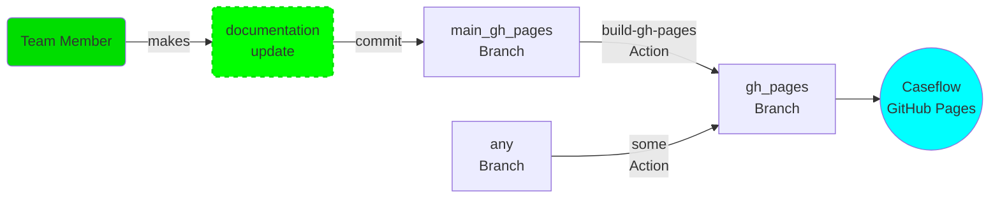
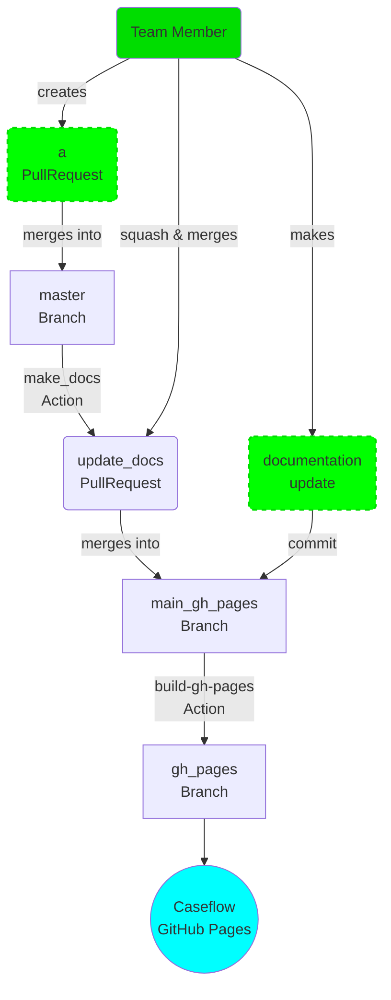

# README
{: .no_toc }

Welcome to the [GitHub Pages](https://pages.github.com/) for [Caseflow](https://github.com/department-of-veterans-affairs/caseflow)!
The webpage can be viewed at [http://department-of-veterans-affairs.github.io/caseflow/](http://department-of-veterans-affairs.github.io/caseflow/).

1. TOC
{:toc}

## Making changes

For small changes, most pages can be modified by clicking on the `Edit this page` link at the bottom of the page, modifying the `md` file, and committing the change.

For larger changes, checkout the `main-gh-pages` branch, make local modifications, and push your changes. This will trigger an update to the `gh-pages` branch used by GitHub Pages.

## Purpose of the `gh-pages` and `main-gh-pages` branches

The ([`gh-pages` branch](https://github.com/department-of-veterans-affairs/caseflow/tree/gh-pages)) contains the `html` and asset files displayed by GitHub Pages. The branch is not intended to be merged in the `master` branch. Note that it has a completely separate commit history from the Caseflow application `master` branch. For more info, see the [FAQ](#how-was-the-gh-pages-branch-created-without-a-commit-history).

The `gh-pages` branch is updated by a `build-gh-pages` GitHub Action that uses files from the `main-gh-pages` branch to generate `html` and asset files, which are pushed to the `gh-pages` branch. You should not modify the `gh-pages` branch directly, so you don't need to `git checkout` the branch. Any commit to the `main-gh-pages` branch will trigger the GitHub Action, which can be seen [here](https://github.com/department-of-veterans-affairs/caseflow/actions/workflows/build-gh-pages.yml). See [Committing changes](committing-changes) for how to make changes.




Note that there may be some other GitHub Action that updates the `gh-pages` branch, so make sure to not cause folder or file name collisions when updating `main-gh-pages`.

## The `main-gh-pages` branch

The `main-gh-pages` branch has files for documentation. Some are automatically generated (e.g., [Caseflow DB schema](schema/html/index.html) by a GitHub Action); others are manually created (e.g., [Bat Team Remedies](batteam/index.html)).

## Checking out the branch

Even though `main-gh-pages` is another branch in the Caseflow repo, it is highly encouraged to check out the `main-gh-pages` branch in a directory separate from `caseflow` because it has no common files with Caseflow's `master` branch and to avoid accidentally deleting git-ignored files in your development branches.

To checkout to a `main-gh-pages` directory as a sibling of your `caseflow` directory:
```
cd $YOUR_PATH_TO/caseflow
cd ..
git clone --recurse-submodules -b main-gh-pages --single-branch https://github.com/department-of-veterans-affairs/caseflow.git main-gh-pages
```

## Committing big changes

Treat the `main-gh-pages` branch like Caseflow's `master` branch. A difference is that anyone can commit to `main-gh-pages` without a peer-review (just like the Caseflow wiki page). However for significant changes, it is encouraged to create a development branch and do a squash-merge when you are satisfied with the changes, just like what is done in Caseflow's `master` branch.

```
cd main-gh-pages
git checkout -b my/add-amazing-new-page
# Make modifications, preview changes, and commit
git add .
git commit

# Once ready to merge
git checkout main-gh-pages
git merge --squash my/add-amazing-new-page
git commit

# Push to GitHub repo
git push
```

## Previewing changes

To preview changes locally, run the website generators locally as follows:
```
make run
# Alternatively, to run from a clean state: make clean_run
```

If it's the first time running it, install some tools:
```
bundle install
make install_jekyll_diagram_dependencies # only needed to view diagrams locally
Stephan Ward - 10/21/2023 comment: Used 'sudo apt install graphviz' to fix dependency issue to view graphs.
```

To update the subsites:
```
make build_subsites
```
which puts the subsites as subdirectories under the `_site` directory.

## Jekyll

This top-level site uses the Jekyll theme [Just the Docs](https://pmarsceill.github.io/just-the-docs/).
The [help](help/) subsite uses a different Jekyll theme, specified in `__help/_config.yml`.

Jekyll can be [configured](https://jekyllrb.com/docs/configuration/) to use [plugins](https://jekyllrb.com/docs/plugins/). Each `md` file can define [front matter](https://jekyllrb.com/docs/front-matter/) to specify how the corresponding page should be treated or visualized by the Jekyll theme.

## Subsites

A *subsite* is useful for presenting documentation using a different theme or layout.

To create a new Jekyll subsite called SUBSITE:
1. Create subdirectory `__SUBSITE` (prefixed with 2 underscores); the underscore prefix is needed so that Jekyll doesn't process it when building the main site
2. Create a new `__SUBSITE/_config.yml` to override the defaults set in `__subsite_config.yml`
3. Add a new entry in `Makefile` to build the `html` files into destination directory `_site/SUBSITE`
4. Add `SUBSITE` to the `keep_files` configuration setting in `_config.yml` so that Jekyll doesn't delete the `_site/SUBSITE` directory when building the main site

Refer to the `__help` directory as an example.

Note that any [static site generator](https://www.netlify.com/blog/2020/04/14/what-is-a-static-site-generator-and-3-ways-to-find-the-best-one/) besides Jekyll can be used, such as Hugo, Gatsby, and Pelican -- adapt the instructions accordingly.

### Jekyll subsite

The [Help subsite](help/) demonstrates how to create a subsite using [Jekyll](https://jekyllrb.com/).

### Hugo subsite

The [Task trees subsite](task_trees/) uses [Hugo](https://gohugo.io/) for its speed in processing the hundreds of task `md` files, among other features. The subsite source files are under the `__task_trees` folder and follows [Hugo's folder structure](https://gohugo.io/getting-started/directory-structure/).

Spending time to read [this tutorial](https://cloudcannon.com/community/learn/hugo-tutorial/) is highly recommended before digging into Hugo's documentation, which is less amenable to learning.

#### Task tree Hugo subsite

Some Hugo customizations have been applied to the [Task trees subsite](task_trees/) to make it easier to update. These customizations are under the `__task_trees` folder.

To add a new section, create a subfolder under the `content` folder. To add the section to the navigation menu, add this front matter to the top of a new `my-subfolder-name/_index.md` file:
```yaml
---
title: My New Section
menu:
  navmenu:
    identifier: my-subfolder-name
    # whether the child pages in this section will be collapsed when not selected
    collapsible: true
# affects ordering in the navigation menu
weight: 3
---

# My New Section
Check out these new pages.
```

Clicking on the section link in the navigation menu will render `_index.md` followed by a listing of the constituent pages. To display the list of pages elsewhere, insert `{{ "{{< pages_list >" }}}}` at the desired location in the `_index.md` file. (This feature is provided by `layouts/_default/list.html` and `layout/shortcodes/pages_list.html`.)

For each page in the new subfolder, add this front matter to the page's `md` file in order to display it in the navigation menu:
```yaml
---
title: Page 1 within Section
menu:
  navmenu:
    parent: my-subfolder-name
weight: 1
---
```

Note that pages and sections with a negative `weight` will not be shown in the navigation menu.

To avoid having to set the 3-line `parent` property for every page, add a [`front matter cascade` configuration](https://gohugo.io/content-management/front-matter#front-matter-cascade) under the `cascade` section of `config.yml` instead, which will set the front matter for all files in `my-subfolder-name` except those beginning with `_`:
```yaml
  - menu:
      navmenu:
        parent: my-subfolder-name
    _target:
      path: /my-subfolder-name/[!_]*
```

To further customize the menu, modify `menu/header.md` and `menu/footer.md`.

### HTML subsite

The [Table associations subsite](schema/html/) is simply a set of `html` files under the `schema/html` folder, which is generated by [Jailer](https://github.com/Wisser/Jailer) run by the [`make_docs` GitHub Action](https://github.com/department-of-veterans-affairs/caseflow/blob/master/.github/workflows/make-docs.yml). Jailer queries Caseflow's DB schema and generates the HTML documentation. Additional bootstrapping was added to Jailer in order for polymorphic associations to be included in the documentation.

## FAQ

### How was the `gh-pages` branch created without a commit history?

```
git checkout --orphan gh-pages
git reset --hard
git commit --allow-empty -m "Initializing gh-pages branch"
git push origin gh-pages
git checkout master
```
([reference](https://jiafulow.github.io/blog/2020/07/09/create-gh-pages-branch-in-existing-repo/))

Also see [GitHub's "Creating your site" instructions](https://docs.github.com/en/pages/setting-up-a-github-pages-site-with-jekyll/creating-a-github-pages-site-with-jekyll#creating-your-site).

### Why not use the GitHub Wiki?

GitHub Wiki has the following limitations:
- Cannot serve up `html` content or files, along with referenced `css` files
- No table of content generation
- No built-in diagramming markup language
- While the wiki context can be organized into folder, the wiki presentation doesn't reflect the organization
- Inability to present different documentation types using different styles/themes/layouts

GitHub Pages provides more control over web page organization and presentation -- see next section.

### Why not use the basic GitHub Pages (without GitHub Actions)?

By default, GitHub Pages employs the Jekyll static site generator to convert `md` files into `html` files, all without any additional configuration -- see [GitHub Pages setup documentation](https://docs.github.com/en/pages/setting-up-a-github-pages-site-with-jekyll/about-github-pages-and-jekyll).

To enable additional website features and documentation presentation capabilities, a GitHub Action runs Jekyll and potentially other tools to generate the `html` files for GitHub Pages. The additional capabilities include:
- incorporating sets of generated `html` files, like [Caseflow DB schema](schema/html/) created via [Jailer](https://github.com/Wisser/Jailer)
- generating table of contents and site navigation menu
- using markup syntax to generate diagrams, like [diagrams.md](help/diagrams)
- enabling subsites with different website themes/layouts, like the [help](help/) subsite
- quick text search (provided by the [Just the Docs theme](https://pmarsceill.github.io/just-the-docs/))

These capabilities open up opportunities for enhanced presentation of Caseflow documentation, which aims to make information easier to find and understand.

### What GitHub Actions are involved?

The following GitHub Actions are employed to create this website:
- [`build-gh-pages`](https://github.com/department-of-veterans-affairs/caseflow/blob/main-gh-pages/.github/workflows/build-gh-pages.yml) in the `main-gh-pages` branch
  1. Triggered when changes are pushed to the `main-gh-pages` branch
  1. Builds this top-level site and subsites (according to the `Makefile`)
    * Installs Ruby, Graphviz, Node, and Python dependencies
    * Runs Jekyll, Hugo, and other static site generators
    * Clones Caseflow code to extract code comments and update the task descriptions for the [Task trees subsite](task_trees/)
    * Commits updated task descriptions to the `main-gh-pages` branch (this does not re-trigger this GitHub Action to run)
  1. Deploys the files generated in `_site` to the `gh-pages` branch, which is displayed by GH Pages
- [`make_docs`](https://github.com/department-of-veterans-affairs/caseflow/blob/master/.github/workflows/make-docs.yml) in the main (`master`) branch
  1. Triggered when a PR is merged to the main branch
  1. Generates Caseflow database documentation files
    * Sets up Caseflow test database
    * Executes a subset of commands run by `make docs`
    * Runs `gen_jailer_schema_docs.sh` to bootstrap and run Jailer
  1. Creates a PR to updates Caseflow database documentation files in the `main-gh-pages` branch
    * Commits updated files to the `main-gh-pages` branch (this will not trigger the `build-gh-pages` GitHub Action to run: "[An action in a workflow run can’t trigger a new workflow run](https://github.community/t/triggering-a-new-workflow-from-another-workflow/16250)")
    * Creates or updates a PR for the `gh-actions/make_docs-update_docs` branch. This PR accumulates documentation changes until it is manually merged into the `main-gh-pages` branch, which will trigger the `build-gh-pages` GitHub Action.

Their execution can be seen under the [Actions tab](https://github.com/department-of-veterans-affairs/caseflow/actions).


