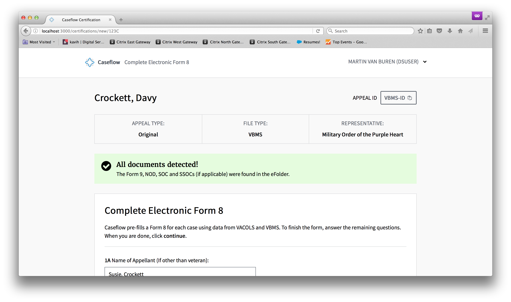

# Caseflow Certification

[](https://travis-ci.org/department-of-veterans-affairs/caseflow-certification)

## About

Clerical errors have the potential to delay the resolution of a veteran's appeal by **months**. Caseflow Certification uses automated error checking, and user-centered design to greatly reduce the number of clerical errors made when certifying appeals from offices around the nation to the Board of Veteran's Appeals in Washington DC.

[You can read more about the project here](https://medium.com/the-u-s-digital-service/new-tool-launches-to-improve-the-benefits-claim-appeals-process-at-the-va-59c2557a4a1c#.t1qhhz7h8).



## Initial Setup (MacOSX)
Make sure you have [rbenv](https://github.com/rbenv/rbenv) installed.

Then run the following:

`$ rbenv install 2.2.4`
`$ gem install bundler`

Install pdftk using the instructions from here:
[https://www.pdflabs.com/tools/pdftk-the-pdf-toolkit/pdftk_server-2.02-mac_osx-10.11-setup.pkg]()

Note this link was found on Stack Overflow and is not the same link that is on the pdftk website.
The version on the website does not work on recent versions of OSX (Sierra and El Capitan).

## Running Caseflow in isolation
To try Caseflow without going through the hastle of connecting to VBMS and VACOLS, just tell bundler
to skip production gems when installing.

`$ bundle install --without production staging`

And by default, Rails will run in the development environment, which will mock out data.

`$ rails s`

You can access the site at [http://localhost:3000](), which takes you to the help page.

To log in, you can use the following credentials:

Username: "DSUSER"
Password: "DSUSER"

To get to the various pages in the workflow we have a set of five URLs of dummy data. 

[http://localhost:3000/certifications/new/123C]() is an appeal that is ready to certify.
[http://localhost:3000/certifications/new/456C]() is an appeal with mismatched docs.
[http://localhost:3000/certifications/new/789C]() is an appeal that is already certified.
[http://localhost:3000/certifications/new/000ERR]() is an appeal that raises a vbms error.
[http://localhost:3000/certifications/new/001ERR]() is an appeal that is missing data.

## Running Caseflow connected to external depedencies
To test the app connected to external dependencies follow

### Set up Oracle
First you'll need to install the libraries required to connect to the VACOLS Oracle database:

#### OSX
1) Download the ["Instant Client Package - Basic" and "Instant Client Package - SDK"](http://www.oracle.com/technetwork/database/features/instant-client/index.html) for Mac 32 or 64bit.

2) Unzip both packages into `/opt/oracle/instantclient_11_2`

3) Setup both packages according to the Oracle documentation:
```
export DYLD_LIBRARY_PATH=/opt/oracle/instantclient_11_2`
cd /opt/oracle/instantclient_11_2
sudo ln -s libclntsh.dylib.11.1 libclntsh.dylib
```

#### Windows
1) Download the ["Instant Client Package - Basic" and "Instant Client Package - SDK"](http://www.oracle.com/technetwork/database/features/instant-client/index.html) for Mac 32 or 64bit.

2) Unzip both packages into `[DIR]`

3) Add `[DIR]` to your `PATH`

### Linux
Note: This has only been tested on Debian based OS. However, it should also work
for Fedora based OS.
 1. Download the ["Instant Client Package - Basic" and "Instant Client Package - SDK"](http://www.oracle.com/technetwork/database/features/instant-client/index.html) for Linux 32 or 64bit (depending on your Ruby architecture)

 1. Unzip both packages into `/opt/oracle/instantclient_11_2`

 1. Setup both packages according to the Oracle documentation:
```sh
export LD_LIBRARY_PATH=/opt/oracle/instantclient_11_2`
cd /opt/oracle/instantclient_11_2
sudo ln -s libclntsh.so.12.1 libclntsh.so
```

### Run the app
Now you'll be able to install the gems required to run the app connected to VBMS and VACOLS:
`$ bundle install --with staging`

Set the development VACOLS credentials as environment variables.  
(ask a team member for them)
```
export VACOLS_USERNAME=username
export VACOLS_PASSWORD=secret_password
```

Finally, just run Rails in the staging environment!
`$ rails s -e staging`

### Running tests

To run the test suite:
`$rake`

