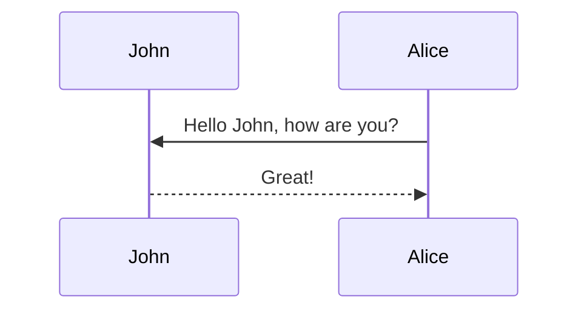

# Diagram examples
{: .no_toc }

Enabled by these Jekyll plugins:
- [jekyll-graphviz](https://github.com/kui/jekyll-graphviz)
- [jekyll-spaceship](https://github.com/jeffreytse/jekyll-spaceship)

**Sections**
* TOC
{:toc}

## graphviz
[Graphviz online editor](http://magjac.com/graphviz-visual-editor/)


digraph {
  node [shape=circle, style=filled];
  S [fillcolor=green];
  A [fillcolor=yellow];
  B [fillcolor=yellow];
  C [fillcolor=yellow];
  D [shape=doublecircle, fillcolor=green];
  S -> A [label=a];
  S -> B [label=b];
  A -> D [label=c];
  B -> D [label=d];
}


## emojis :clap:

:bowtie: I give this plugin two :+1:!

[Emojis](https://www.webfx.com/tools/emoji-cheat-sheet/)

## table

- Cells spanning multiple rows

|              Stage | Direct Products | ATP Yields |
| -----------------: | --------------: | ---------: |
|         Glycolysis |          2 ATP              ||
| ^^                 |          2 NADH |   3--5 ATP |
| Pyruvaye oxidation |          2 NADH |      5 ATP |
|  Citric acid cycle |          2 ATP              ||
| ^^                 |          6 NADH |     15 ATP |
| ^^                 |          2 FADH |      3 ATP |
|                               30--32 ATP        |||

| :    Easy Multiline   : |||
| :----- | :----- | :------ |
| Apple  | Banana | Orange  \
| Apple  | Banana | Orange  \
| Apple  | Banana | Orange
| Apple  | Banana | Orange  \
| Apple  | Banana | Orange  |
| Apple  | Banana | Orange  |

- Table header not required

|--|--|--|--|--|--|--|--|
|♜| |♝|♛|♚|♝|♞|♜|
| |♟|♟|♟| |♟|♟|♟|
|♟| |♞| | | | | |
| |♗| | |♟| | | |
| | | | |♙| | | |
| | | | | |♘| | |
|♙|♙|♙|♙| |♙|♙|♙|
|♖|♘|♗|♕|♔| | |♖|

- Cells spanning multiple columns
- Cells text align separately

| :        Fruits \|\| Food       : |||
| :--------- | :-------- | :--------  |
| Apple      | : Apple : | Apple      \
| Banana     |   Banana  | Banana     \
| Orange     |   Orange  | Orange     |
| :   Rowspan is 4    : || How's it?  |
|^^    A. Peach         ||   1. Fine :|
|^^    B. Orange        ||^^ 2. Bad   |
|^^    C. Banana        ||  It's OK!  |

- make markown syntax possible inside a cell

| :                   MathJax \|\| Image                 : |||
| :------------ | :-------- | :----------------------------- |
| Apple         | : Apple : | Apple                          \
| Banana        | Banana    | Banana                         \
| Orange        | Orange    | Orange                         |
| :     Rowspan is 4     : || :        How's it?           : |
| ^^     A. Peach          ||    1. ![example][cell-image]   |
| ^^     B. Orange         || ^^ 2. $I = \int \rho R^{2} dV$ |
| ^^     C. Banana         || **It's OK!**                   |

[cell-image]: https://jekyllrb.com/img/octojekyll.png "An exemplary image"

See more features at [spaceship-table-usage](https://github.com/jeffreytse/jekyll-spaceship#1-table-usage)

## math

$ a * b = c ^ b $

$ 2^{\frac{n-1}{3}} $

$ \int\_a^b f(x)\,dx. $

## mermaid

[Mermaid online editor](https://mermaid-js.github.io/mermaid-live-editor/edit)

## plantuml

[PlantUML language specification](https://plantuml.com/sitemap-language-specification)
[PlantUML online editor](http://www.plantuml.com/plantuml/uml)

1
@startuml
class Car

Driver - Car : drives >
Car *- Wheel : have 4 >
Car -- Person : < owns

@enduml

2
@startuml
Alice -> Bob: Authentication Request
Bob --> Alice: Authentication Response

Alice -> Bob: Another authentication Request
Alice <-- Bob: Another authentication Response
Alice --> Bob: <math>x = (-b+-sqrt(b^2-4ac))/(2a)</math>
@enduml

3
@startuml
participant Participant as Foo
actor       Actor       as Foo1
boundary    Boundary    as Foo2
control     Control     as Foo3
entity      Entity      as Foo4
database    Database    as Foo5
collections Collections as Foo6
queue       Queue       as Foo7
Foo -> Foo1 : To actor 
Foo -> Foo2 : To boundary
Foo -> Foo3 : To control
Foo -> Foo4 : To entity
Foo -> Foo5 : To database
Foo -> Foo6 : To collections
Foo -> Foo7: To queue
@enduml

4
@startuml
actor Bob #red
' The only difference between actor
'and participant is the drawing
participant Alice
participant "I have a really\nlong name" as L #99FF99
/' You can also declare:
   participant L as "I have a really\nlong name"  #99FF99
  '/

Alice->Bob: Authentication Request
Bob->Alice: Authentication Response
Bob->L: Log transaction
@enduml

5
@startuml
Alice -> Bob: Authentication Request

alt successful case

    Bob -> Alice: Authentication Accepted

else some kind of failure

    Bob -> Alice: Authentication Failure
    group My own label
    Alice -> Log : Log attack start
        loop 1000 times
            Alice -> Bob: DNS Attack
        end
    Alice -> Log : Log attack end
    end

else Another type of failure

   Bob -> Alice: Please repeat

end
@enduml

6
@startuml

package "Some Group" {
  HTTP - [First Component]
  [Another Component]
}

node "Other Groups" {
  FTP - [Second Component]
  [First Component] --> FTP
}

cloud {
  [Example 1]
}

database "MySql" {
  folder "This is my folder" {
    [Folder 3]
  }
  frame "Foo" {
    [Frame 4]
  }
}

[Another Component] --> [Example 1]
[Example 1] --> [Folder 3]
[Folder 3] --> [Frame 4]

@enduml

7
@startuml

[*] --> State1
State1 --> [*]
State1 : this is a string
State1 : this is another string

State1 -> State2
State2 --> [*]

@enduml

8
@startuml
@startwbs
+ Project
 + Part One
  + Task 1.1
   - LeftTask 1.2
   + Task 1.3
  + Part Two
   + Task 2.1
   + Task 2.2
   -_ Task 2.2.1 To the left boxless
   -_ Task 2.2.2 To the Left boxless
   +_ Task 2.2.3 To the right boxless
@endwbs
@enduml

9
@startuml
@startmindmap
* Debian
** Ubuntu
*** Linux Mint
*** Kubuntu
*** Lubuntu
*** KDE Neon
** LMDE
** SolydXK
** SteamOS
** Raspbian with a very long name
*** <s>Raspmbc</s> => OSMC
*** <s>Raspyfi</s> => Volumio
@endmindmap
@enduml

@startuml
@startmindmap
caption figure 1
title My super title

* <&flag>Debian
** <&globe>Ubuntu
*** Linux Mint
*** Kubuntu
*** Lubuntu
*** KDE Neon
** <&graph>LMDE
** <&pulse>SolydXK
** <&people>SteamOS
** <&star>Raspbian with a very long name
*** <s>Raspmbc</s> => OSMC
*** <s>Raspyfi</s> => Volumio

header
My super header
endheader

center footer My super footer

legend right
  Short
  legend
endlegend
@endmindmap
@enduml

10
@startuml
@startgantt
[Prototype design] lasts 13 days and is colored in Lavender/LightBlue
[Test prototype] lasts 9 days and is colored in Coral/Green and starts 3 days after [Prototype design]'s end
[Write tests] lasts 5 days and ends at [Prototype design]'s end
[Hire tests writers] lasts 6 days and ends at [Write tests]'s start
[Init and write tests report] is colored in Coral/Green
[Init and write tests report] starts 1 day before [Test prototype]'s start and ends at [Test prototype]'s end
@endgantt
@enduml

## math in uml
@startuml
:<math>int_0^1f(x)dx</math>;
:<math>x^2+y_1+z_12^34</math>;
note right
Try also
<math>d/dxf(x)=lim_(h->0)(f(x+h)-f(x))/h</math>
<math>P(y|bb"x") or f(bb"x")+epsilon</math>
end note
@enduml

## youtube

