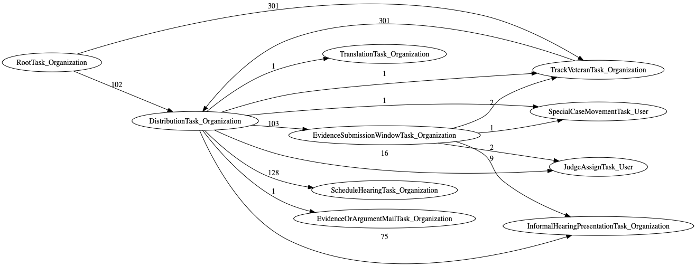

## Data-Driven Documentation of Task Trees

### Purpose and uses

The main purpose of this documentation is to use actual appeal data to inform and supplement current documentation, which may be outdated or lack technical detail.
This documentation expands on the [Tasks wiki documentation](https://github.com/department-of-veterans-affairs/caseflow/wiki/Tasks) and validates the [Explaining Caseflow Tasks slide deck](https://docs.google.com/presentation/d/1Cc84GH7giWHTNxUe3zixH7O-QT77STlptYfud9X8P1Y) with up-to-date concrete examples.

This documentation is useful for the following:

- General onboarding: New team members can browse through this documentation to gain an understanding of task types (with realistic examples of task trees), their relationships, and their counts, which can help prioritize their learning strategy.
- Targeted training: Specific subsets of tasks or task trees can be copied to training material or referenced in GitHub issues to enhance understanding and/or provide further evidence.
- Data integrity: This documentation offers basic statistics to help identify common and unusual task trees, which can prompt proactive automated integrity checks or rules to prevent undesirable task trees (and hence future bugs).
- Bat Team problem diagnosis: A common step to diagnosing a problem is to inspect the subject task tree. This documentation offers existing task trees for comparison to assess if a similar task tree exists and with what frequency. With manually added descriptions of how specific task trees came to be and the reason for the presence of each task, this documentation can help identify the problem and a potential remedy (e.g., the subject task tree should be changed to look like existing task trees).
- Knowledge sharing: This documentation provides a comprehensive, updated view into the task tree structures of _all_ existing appeals. The information is presented in an accessible manner with visualizations to be used by both technical and non-technical team members.

It is expected that other uses of this documentation will arise as more domain information is manually added.

When new task types are added or task tree structures change, this documentation can be readily regenerated to maintain up-to-date documentation.

### Contents

Actual task trees from AMA appeals were used to generate this documentation.

- [Tasks Overview](/trees/task_descr/tasks-overview)
- [User Roles Overview](/trees/roles/role-overview)
- [List of all task types](/trees/alltasks) use in actual appeals
- To get an idea of typical task trees, check out the Frequent Parent-Child Relationships for each docket type: [DR:parent-child](/trees/docket-DR/freq-parentchild), [ES:parent-child](/trees/docket-ES/freq-parentchild), and [H:parent-child](/trees/docket-H/freq-parentchild).
- To get an idea of when tasks are created, check out the Frequent Task Creation Sequences for each docket type: [DR:task-creation](/trees/docket-DR/freq-taskcreation), [ES:task-creation](/trees/docket-ES/freq-taskcreation), and [H:task-creation](/trees/docket-H/freq-taskcreation).

AMA appeals are handled by BVA according to their assigned docket. Since there are different procedures associated with a particular docket, the resulting task tree structures are different. This documentation presents task trees according to the three docket types for the [AMA Decision Review Process](https://www.bva.va.gov/docs/Decision_Review_Process_Slides.pdf):

- [Direct Review docket task listing](/trees/docket-DR/tasklist.md): The Direct Review docket contains appeals where the Veteran has decided they _do not_ want to add new evidence and _do not_ want a hearing.
- [Evidence Submission docket task listing](/trees/docket-ES/tasklist.md): On the Evidence Submission docket, a Veteran can add evidence during the 90 days after they begin their appeal.
- [Hearing docket task listing](/trees/docket-H/tasklist.md): On the Hearing Request docket, the Veteran has requested a scheduled hearing with a judge, where the Veteran can present new evidence and testifies their benefit claim. They can submit evidence at their hearing or within 90 days after the hearing.

You can start using the documentation by clicking on one of the above task listing links (no one should need to directly view the files in any of the `docs-*` subdirectories).
Each task listing page linked above presents a list of tasks relevant to the particular docket.
Each task has its own page (i.e., an `md` file).

### Task Page

Each task page has the following sections:

- A link to a description page, which should be manually filled with relevant information such as description of the task, scenarios where it is created, and other information to help understand the context and motivation for the task. See [task descriptions](https://github.com/department-of-veterans-affairs/caseflow/wiki/Task-Types) for source material.
- "Parent and Child Tasks" section
  - **Parent Tasks**: links to tasks that are _parents_ of the page's task
  - **Child Tasks**: links to tasks that are _children_ of the page's task
- "Tasks Created Before and After" section
  - A diagram of inlinks and outlinks to the task page. The number labeled on the link represents the number of occurrences where the creation of source task was followed by the creation of the destination task.
  - **Before**: links to tasks that were created _before_ the page's task
  - **After**: links to tasks that were created _after_ the page's task
- "Task Creation Sequences" section: Examples grouped according to the sequence of tasks created up to the page's task.
  - Section names are formed using acronyms for each task. For example, `RootTask_Organization` is `RTO`. So a section named `RTO.TVTO.DTO.SHTO` means `RootTask_Organization` was created and followed by `TrackVeteranTask_Organization` followed by `DistributionTask_Organization` followed by `ScheduleHearingTask_Organization`. The naming represents the **task creation sequence** (TCS). The last task in the sequence will always refer to the page's task.
  - Each section has a link to a description page, which should be manually filled with relevant information such as how and why the task sequence is created. Only some of these description pages were automatically created. As needed, add `md` files for pages that do not yet exist.
  - Each section presents the number of occurrences of that TCS (along with a few appeal IDs that have that TCS) and a task tree diagram of that appeal. The diagram annotates each task with a number representing the task creation order.
  - Note that some tasks (e.g., [InformalHearingPresentationTask_Organization](/trees/task_descr/InformalHearingPresentationTask_Organization.md)) can be created before its parent task. This can happen when an existing task is moved to a newly-created parent task.

On the task listing pages and all the task pages, the content is presented by order of occurrence counts so that the most common tasks or TCSs (Task Creation Sequences) are presented first. Task trees with few occurrences may indicate unusual or undesirable appeal states, which is relevant to the Data Integrity and Bat Team.

### Notes

- The Graphviz code used to generate the graph on each task page can be combined to show multi-hop/indirect relationships. For example, the following graph shows the task creation order pulled from the `RootTask_Organization`, `DistributionTask_Organization`, `EvidenceSubmissionWindowTask_Organization` task pages. From this, we can surmise that `JudgeAssignTask_User` is always created after `DistributionTask_Organization`.

<details><summary>Task creation order combined from 3 task pages</summary>

```
digraph G {
  rankdir="LR";
  "DistributionTask_Organization" -> "TrackVeteranTask_Organization" [label=1]
  "EvidenceSubmissionWindowTask_Organization" -> "TrackVeteranTask_Organization" [label=2]
  "EvidenceSubmissionWindowTask_Organization" -> "SpecialCaseMovementTask_User" [label=1]
  "DistributionTask_Organization" -> "JudgeAssignTask_User" [label=16]
  "EvidenceSubmissionWindowTask_Organization" -> "JudgeAssignTask_User" [label=2]
  "DistributionTask_Organization" -> "ScheduleHearingTask_Organization" [label=128]
  "RootTask_Organization" -> "DistributionTask_Organization" [label=102]
  "DistributionTask_Organization" -> "EvidenceOrArgumentMailTask_Organization" [label=1]
  "EvidenceSubmissionWindowTask_Organization" -> "InformalHearingPresentationTask_Organization" [label=9]
  "DistributionTask_Organization" -> "SpecialCaseMovementTask_User" [label=1]
  "DistributionTask_Organization" -> "EvidenceSubmissionWindowTask_Organization" [label=103]
  "RootTask_Organization" -> "TrackVeteranTask_Organization" [label=301]
  "DistributionTask_Organization" -> "InformalHearingPresentationTask_Organization" [label=75]
  "TrackVeteranTask_Organization" -> "DistributionTask_Organization" [label=301]
  "DistributionTask_Organization" -> "TranslationTask_Organization" [label=1]
}
```
</details>



- Manually-added content is kept in the `task_descr` subdirectory.
- Generated files are placed in the `docs-*` subdirectories, which can be deleted and regenerated. To regenerate the files, use the `gen_ttdocs.py` and `createPngs.sh` scripts in the [trees directory](https://github.com/department-of-veterans-affairs/caseflow/tree/main-gh-pages/__task_trees/content/trees).
