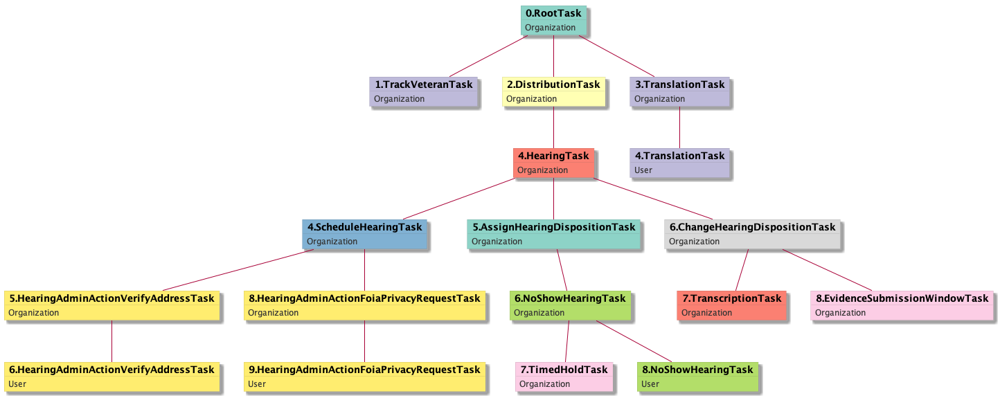
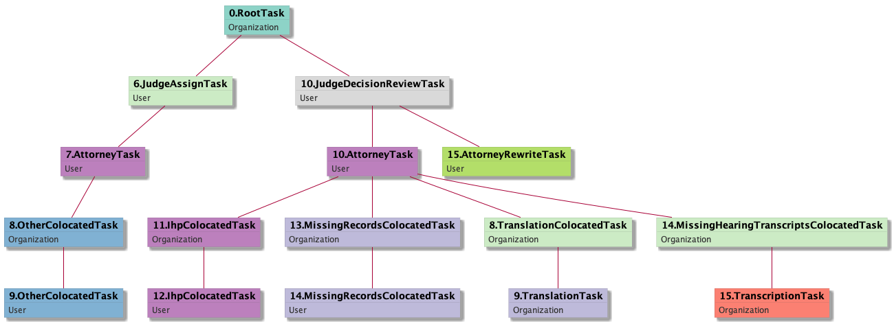
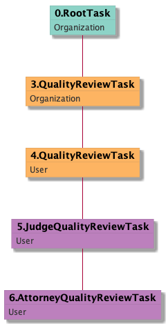
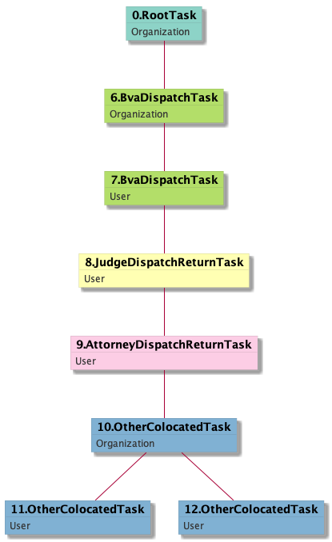

| [README](../README.md) | [All tasks](../alltasks.md) | [DR tasks](../docs-DR/tasklist.md) | [ES tasks](../docs-ES/tasklist.md) | [H tasks](../docs-H/tasklist.md) |

See [How to use](../README.md#how-to-use-and-interpret-this-documentation) for a description of the docket types: Direct Review (DR), Evidence Submission (ES), and Hearing (H).

Appeals Process: [mural](https://app.mural.co/t/workqueue2001/m/workqueue2001/1561671251478/5b71dc3125e2075289be03161b4cf6f42896184d)

# Tasks Overview

The tasks presented on this page are organized into phases of the appeal process:
* [Regional Office Phase](#regional-office-phase)
* [Intake Phase](#intake-phase)
* [Hearing Phase](#hearing-phase)
* [Decision Phase](#decision-phase)
* [Quality Review Phase](#quality-review-phase)
* [Dispatch Phase](#dispatch-phase)

How to interpret bullets and subbullets in "Associated tasks" sections:
* When a child task is always (or almost always) a child of a specific parent task, it is shown as a subbullet under the associated parent task.
* When a task is noted as only occurring for certain dockets, all child tasks also only occur for those specified dockets.
* The parent-child relationships were inferred by examining the **Parent Tasks** section of each task page for all dockets (e.g., [Parent Tasks for JudgeDecisionReviewTask_User](../docs-DR/JudgeDecisionReviewTask_User.md#parent-and-child-tasks)).  The frequent parent-child relationships for each docket type ([DR:parent-child](../docs-DR/freq-parentchild.md), [ES:parent-child](../docs-ES/freq-parentchild.md) and [H:parent-child](../docs-H/freq-parentchild.md)) was also helpful.

At the bottom of the page are:
* [MailTasks](#mailtasks)
* [other tasks](#other-tasks) and
* [deprecated tasks](#deprecated-tasks)

## Regional Office Phase
Background:
* [VSOs](https://github.com/department-of-veterans-affairs/caseflow/wiki/VSOs)

Associated tasks:
* [RootTask_Organization](RootTask_Organization.md) - not specific this phase
  * [TrackVeteranTask_Organization](TrackVeteranTask_Organization.md) - can happen at any phase

## Intake Phase
Background:
* [Intake](https://github.com/department-of-veterans-affairs/appeals-team/wiki/Intake)
* [Caseflow Intake](https://github.com/department-of-veterans-affairs/caseflow/wiki/Caseflow-Intake)
  * [Intake Data Model](https://github.com/department-of-veterans-affairs/caseflow/wiki/Intake-Data-Model)
* [Issues presentation](https://github.com/department-of-veterans-affairs/appeals-team/blob/master/Project%20Folders/Caseflow%20Projects/Intake/AMA%20ISSUES.pdf)
* [Intake Search training video](https://www.youtube.com/watch?v=_M-5NXVMDZs&feature=youtu.be)

Tasks created upon Intake Phase success (see [`Appeal#create_tasks_on_intake_success!`](https://github.com/department-of-veterans-affairs/caseflow/blob/f881ded814011e11b6adaa88038b4afb8950e7c2/app/models/appeal.rb#L421)):
* [TrackVeteranTask_Organization](TrackVeteranTask_Organization.md)
* [DistributionTask_Organization](DistributionTask_Organization.md)
  * [EvidenceSubmissionWindowTask_Organization](EvidenceSubmissionWindowTask_Organization.md) if in ES docket
  * [ScheduleHearingTask_Organization](ScheduleHearingTask_Organization.md) if in H docket
  * [InformalHearingPresentationTask_Organization](InformalHearingPresentationTask_Organization.md)
    if the representing VSO [`should_write_ihp?(appeal)`](https://github.com/department-of-veterans-affairs/caseflow/blob/master/app/workflows/ihp_tasks_factory.rb#L10); occurs only in DR and ES dockets
    * [InformalHearingPresentationTask_User](InformalHearingPresentationTask_User.md)
* [TranslationTask_Organization](TranslationTask_Organization.md)
  * [TranslationTask_User](TranslationTask_User.md)
* [VeteranRecordRequest_Organization](VeteranRecordRequest_Organization.md)

The following fake task tree merges several appeals to exemplify parent-child task relationships associated with the Intake and prior phases
(Click on task links above to browse for task trees of actual appeals):

(diagram code: [intake-phase-tasktree.uml](intake-phase-tasktree.uml))

## Hearing Phase
Background:
* [Caseflow Hearings](https://github.com/department-of-veterans-affairs/caseflow/wiki/Caseflow-Hearings)

Associated tasks:
* [RootTask_Organization](RootTask_Organization.md) - not specific this phase
  * [DistributionTask_Organization](DistributionTask_Organization.md)
    * [HearingTask_Organization](HearingTask_Organization.md) only in Hearing docket; almost always a child task of DistributionTask_Organization
      * [ScheduleHearingTask_Organization](ScheduleHearingTask_Organization.md)
        * [**HearingAdminActionTask**](https://github.com/department-of-veterans-affairs/caseflow/blob/master/app/models/tasks/hearing_admin_action_task.rb) -
          blocks scheduling a Veteran for a hearing. 
          A few scenarios (e.g., missing data or Veteran situations) automatically create HearingAdminTasks.
          A hearing coordinator must resolve these before scheduling a Veteran.
          Subclasses of various hearing admin actions are listed below.
        * [HearingAdminActionVerifyAddressTask_Organization](HearingAdminActionVerifyAddressTask_Organization.md)
          * [HearingAdminActionVerifyAddressTask_User](HearingAdminActionVerifyAddressTask_User.md)
        * [HearingAdminActionOtherTask_Organization](HearingAdminActionOtherTask_Organization.md)
            * [HearingAdminActionOtherTask_User](HearingAdminActionOtherTask_User.md)
        * [HearingAdminActionForeignVeteranCaseTask_Organization](HearingAdminActionForeignVeteranCaseTask_Organization.md)
        * [HearingAdminActionFoiaPrivacyRequestTask_Organization](HearingAdminActionFoiaPrivacyRequestTask_Organization.md)
          * [HearingAdminActionFoiaPrivacyRequestTask_User](HearingAdminActionFoiaPrivacyRequestTask_User.md)
        * HearingAdminActionContestedClaimantTask - 0 occurrences
      * [AssignHearingDispositionTask_Organization](AssignHearingDispositionTask_Organization.md) or
        [ChangeHearingDispositionTask_Organization](ChangeHearingDispositionTask_Organization.md)
        * [NoShowHearingTask_Organization](NoShowHearingTask_Organization.md)
          * [NoShowHearingTask_User](NoShowHearingTask_User.md)
          * [TimedHoldTask_Organization](TimedHoldTask_Organization.md)
        * [TranscriptionTask_Organization](TranscriptionTask_Organization.md) only in Hearing docket (1 occurrence in ES docket); can also be a child of [MissingHearingTranscriptsColocatedTask_Organization](MissingHearingTranscriptsColocatedTask_Organization.md)
* [EvidenceSubmissionWindowTask_Organization](EvidenceSubmissionWindowTask_Organization.md) only in ES and H dockets

The following fake task tree merges several appeals to exemplify parent-child task relationships associated with the Hearing and prior phases
(Click on task links above to browse for task trees of actual appeals):

(diagram code: [hearing-phase-tasktree.uml](hearing-phase-tasktree.uml))

## Decision Phase

Background:
* [Caseflow Queue](https://github.com/department-of-veterans-affairs/caseflow/wiki/Caseflow-Queue)
  * [VLJ Support](https://github.com/department-of-veterans-affairs/caseflow/wiki/VLJ-Support), [interactions with other teams (FOIA/Privacy Act, IHP, ...)](https://github.com/department-of-veterans-affairs/caseflow/wiki/VLJ-Support-Staff-nteractions-with-other-teams)
  * [Organizations](https://github.com/department-of-veterans-affairs/caseflow/wiki/Organizations)
  * [Fixing task trees](https://github.com/department-of-veterans-affairs/caseflow/wiki/Fixing-task-trees)
  * [structure_render](https://github.com/department-of-veterans-affairs/caseflow/wiki/Investigating-and-diagnosing-issues) and [task tree render](https://github.com/department-of-veterans-affairs/caseflow/wiki/Task-Tree-Render)
* [Caseflow Reader](https://github.com/department-of-veterans-affairs/caseflow/wiki/Caseflow-Reader)
* [Routing of admin actions changed (deprecating some Colocated tasks)](https://github.com/department-of-veterans-affairs/caseflow/issues/11113)

Associated tasks:
* [RootTask_Organization](RootTask_Organization.md) - not specific this phase
  * [JudgeAssignTask_User](JudgeAssignTask_User.md)
    * [AttorneyTask_User](AttorneyTask_User.md)
  * [JudgeDecisionReviewTask_User](JudgeDecisionReviewTask_User.md)
    * [AttorneyTask_User](AttorneyTask_User.md)
    * [AttorneyRewriteTask_User](AttorneyRewriteTask_User.md)

Colocated tasks are usually children of [AttorneyTasks](AttorneyTask_User.md):

(Click left triangle to expand list of colocated tasks, ordered by occurrence count.)

  * [OtherColocatedTask_Organization](OtherColocatedTask_Organization.md)
    * [OtherColocatedTask_User](OtherColocatedTask_User.md)
  * [IhpColocatedTask_Organization](IhpColocatedTask_Organization.md)
    * [IhpColocatedTask_User](IhpColocatedTask_User.md)
  * [FoiaColocatedTask_Organization](FoiaColocatedTask_Organization.md)
    * [FoiaTask_Organization](FoiaTask_Organization.md)
      * [FoiaTask_User](FoiaTask_User.md)
  * [PreRoutingFoiaColocatedTask_Organization](PreRoutingFoiaColocatedTask_Organization.md) - deprecated? #13266
    * [PreRoutingFoiaColocatedTask_User](PreRoutingFoiaColocatedTask_User.md) - deprecated? #13266
  * [OtherColocatedTask_User](OtherColocatedTask_User.md) or [deprecated? PreRoutingFoiaColocatedTask_User](PreRoutingFoiaColocatedTask_User.md)
    * [PrivacyActTask_Organization](PrivacyActTask_Organization.md)
  * [PreRoutingTranslationColocatedTask_Organization](PreRoutingTranslationColocatedTask_Organization.md) only in DR and ES dockets - deprecated? #11113
    * [PreRoutingTranslationColocatedTask_User](PreRoutingTranslationColocatedTask_User.md) - deprecated? #11113
      * [PrivacyActTask_User](PrivacyActTask_User.md)
  * [PreRoutingMissingHearingTranscriptsColocatedTask_Organization](PreRoutingMissingHearingTranscriptsColocatedTask_Organization.md) - deprecated? #11113
    * [PreRoutingMissingHearingTranscriptsColocatedTask_User](PreRoutingMissingHearingTranscriptsColocatedTask_User.md) - deprecated? #11113
  * [MissingRecordsColocatedTask_Organization](MissingRecordsColocatedTask_Organization.md)
    * [MissingRecordsColocatedTask_User](MissingRecordsColocatedTask_User.md)
  * [ScheduleHearingColocatedTask_Organization](ScheduleHearingColocatedTask_Organization.md)
    * [ScheduleHearingColocatedTask_User](ScheduleHearingColocatedTask_User.md)
  * [StayedAppealColocatedTask_Organization](StayedAppealColocatedTask_Organization.md)
    * [StayedAppealColocatedTask_User](StayedAppealColocatedTask_User.md)
  * [ExtensionColocatedTask_Organization](ExtensionColocatedTask_Organization.md)
    * [ExtensionColocatedTask_User](ExtensionColocatedTask_User.md)
  * [HearingClarificationColocatedTask_Organization](HearingClarificationColocatedTask_Organization.md)
    * [HearingClarificationColocatedTask_User](HearingClarificationColocatedTask_User.md)
  * [PoaClarificationColocatedTask_Organization](PoaClarificationColocatedTask_Organization.md)
    * [PoaClarificationColocatedTask_User](PoaClarificationColocatedTask_User.md)
  * [TranslationColocatedTask_Organization](TranslationColocatedTask_Organization.md)
  * [AddressVerificationColocatedTask_Organization](AddressVerificationColocatedTask_Organization.md)
    * [AddressVerificationColocatedTask_User](AddressVerificationColocatedTask_User.md)
  * [AojColocatedTask_Organization](AojColocatedTask_Organization.md)
    * [AojColocatedTask_User](AojColocatedTask_User.md)
  * [NewRepArgumentsColocatedTask_Organization](NewRepArgumentsColocatedTask_Organization.md)
    * [NewRepArgumentsColocatedTask_User](NewRepArgumentsColocatedTask_User.md)
  * [MissingHearingTranscriptsColocatedTask_Organization](MissingHearingTranscriptsColocatedTask_Organization.md)
  * [PendingScanningVbmsColocatedTask_Organization](PendingScanningVbmsColocatedTask_Organization.md)
    * [PendingScanningVbmsColocatedTask_User](PendingScanningVbmsColocatedTask_User.md)
  * [UnaccreditedRepColocatedTask_Organization](UnaccreditedRepColocatedTask_Organization.md)
    * [UnaccreditedRepColocatedTask_User](UnaccreditedRepColocatedTask_User.md)

The following fake task tree merges several appeals to exemplify parent-child task relationships associated with the Decision phase
(Click on task links above to browse for task trees of actual appeals):

(diagram code: [decision-phase-tasktree.uml](decision-phase-tasktree.uml))

## Quality Review Phase
Background:
* [Quality Review](https://github.com/department-of-veterans-affairs/caseflow/wiki/Quality-Review)

Associated tasks:
* [QualityReviewTask_Organization](QualityReviewTask_Organization.md)
  * [QualityReviewTask_User](QualityReviewTask_User.md)
    * [JudgeQualityReviewTask_User](JudgeQualityReviewTask_User.md)
      * [AttorneyQualityReviewTask_User](AttorneyQualityReviewTask_User.md)

The following fake task tree merges several appeals to exemplify parent-child task relationships associated with the Quality Review phase
(Click on task links above to browse for task trees of actual appeals):

(diagram code: [qualreview-phase-tasktree.uml](qualreview-phase-tasktree.uml))

## Dispatch Phase
Background:
* [BVA Dispatch](https://github.com/department-of-veterans-affairs/caseflow/wiki/BVA-Dispatch)

Associated tasks:
* [BvaDispatchTask_Organization](BvaDispatchTask_Organization.md)
  * [BvaDispatchTask_User](BvaDispatchTask_User.md)
    * [JudgeDispatchReturnTask_User](JudgeDispatchReturnTask_User.md) almost only in DR and ES dockets
      * [AttorneyDispatchReturnTask_User](AttorneyDispatchReturnTask_User.md) only in DR and ES dockets

The following fake task tree merges several appeals to exemplify parent-child task relationships associated with the Quality Review phase
(Click on task links above to browse for task trees of actual appeals):

(diagram code: [dispatch-phase-tasktree.uml](dispatch-phase-tasktree.uml))

## MailTasks

A [mail task](https://github.com/department-of-veterans-affairs/caseflow/blob/master/app/models/tasks/mail_task.rb) is used to track when the mail team receives any appeal-related mail from an appellant.
* Mail is processed by a mail team member, and then a corresponding task is then assigned to an organization.
* Such tasks are assigned to organizations, including VLJ Support, AOD team, Privacy team, and Lit Support, and include:
  * add Evidence or Argument ([EvidenceOrArgumentMailTask_Organization](EvidenceOrArgumentMailTask_Organization.md))
  * changing Power of Attorney (POA, [PowerOfAttorneyRelatedMailTask_Organization](PowerOfAttorneyRelatedMailTask_Organization.md))
  * advance a case on docket (AOD = advance on docket, [AodMotionMailTask_Organization](AodMotionMailTask_Organization.md))
  * withdrawing an appeal ([AppealWithdrawalMailTask_Organization](AppealWithdrawalMailTask_Organization.md))
  * switching dockets ([DocketSwitchMailTask_Organization](DocketSwitchMailTask_Organization.md))

Based on existing appeals, the following tasks can happen at any time after the DistributionTask and before the BvaDispatchTask:
* [EvidenceOrArgumentMailTask_Organization](EvidenceOrArgumentMailTask_Organization.md)
  * [EvidenceOrArgumentMailTask_User](EvidenceOrArgumentMailTask_User.md) only in DR and ES dockets

(Click left triangle to expand list of other MailTasks)

* [AodMotionMailTask_Organization](AodMotionMailTask_Organization.md)
  * [AodMotionMailTask_User](AodMotionMailTask_User.md)
* [HearingRelatedMailTask_Organization](HearingRelatedMailTask_Organization.md)
  * [HearingRelatedMailTask_User](HearingRelatedMailTask_User.md)
* [ReturnedUndeliverableCorrespondenceMailTask_Organization](ReturnedUndeliverableCorrespondenceMailTask_Organization.md)
  * [ReturnedUndeliverableCorrespondenceMailTask_User](ReturnedUndeliverableCorrespondenceMailTask_User.md)
* [PowerOfAttorneyRelatedMailTask_Organization](PowerOfAttorneyRelatedMailTask_Organization.md) only in DR and ES dockets
  * [PowerOfAttorneyRelatedMailTask_User](PowerOfAttorneyRelatedMailTask_User.md)
* [StatusInquiryMailTask_Organization](StatusInquiryMailTask_Organization.md)
  * [StatusInquiryMailTask_User](StatusInquiryMailTask_User.md)
* [CongressionalInterestMailTask_Organization](CongressionalInterestMailTask_Organization.md)
  * [CongressionalInterestMailTask_User](CongressionalInterestMailTask_User.md)
* [ExtensionRequestMailTask_Organization](ExtensionRequestMailTask_Organization.md)
  * [ExtensionRequestMailTask_User](ExtensionRequestMailTask_User.md)
* [FoiaRequestMailTask_Organization](FoiaRequestMailTask_Organization.md)
  * [FoiaRequestMailTask_User](FoiaRequestMailTask_User.md)
* [VacateMotionMailTask_Organization](VacateMotionMailTask_Organization.md) only in DR and ES dockets
  * [VacateMotionMailTask_User](VacateMotionMailTask_User.md)
* [OtherMotionMailTask_Organization](OtherMotionMailTask_Organization.md)
  * [OtherMotionMailTask_User](OtherMotionMailTask_User.md)
* [AddressChangeMailTask_Organization](AddressChangeMailTask_Organization.md)
  * [AddressChangeMailTask_User](AddressChangeMailTask_User.md)
* [ReconsiderationMotionMailTask_Organization](ReconsiderationMotionMailTask_Organization.md)
  * [ReconsiderationMotionMailTask_User](ReconsiderationMotionMailTask_User.md)
* [ControlledCorrespondenceMailTask_Organization](ControlledCorrespondenceMailTask_Organization.md)
  * [ControlledCorrespondenceMailTask_User](ControlledCorrespondenceMailTask_User.md)
* [DeathCertificateMailTask_Organization](DeathCertificateMailTask_Organization.md)
  * [DeathCertificateMailTask_User](DeathCertificateMailTask_User.md)
* [AppealWithdrawalMailTask_Organization](AppealWithdrawalMailTask_Organization.md)
* [PrivacyActRequestMailTask_Organization](PrivacyActRequestMailTask_Organization.md)
* [ClearAndUnmistakeableErrorMailTask_Organization](ClearAndUnmistakeableErrorMailTask_Organization.md)

## Other Tasks
Background:
* [Litigation Support](https://github.com/department-of-veterans-affairs/caseflow/wiki/Litigation-Support) handles congressional inquiries, motions (pre- and post-decisional), CAVC remands, and responds to status inquiries on BVA cases. They are one of the last known teams who received a Queue and will work in Caseflow.

Other tasks:
* [TimedHoldTask_User](TimedHoldTask_User.md)
* [Task_Organization](Task_Organization.md)
  * [Task_User](Task_User.md)
* [SpecialCaseMovementTask_User](SpecialCaseMovementTask_User.md) - always has parent [DistributionTask_Organization](DistributionTask_Organization.md)
* [BoardGrantEffectuationTask_Organization](BoardGrantEffectuationTask_Organization.md)
* [PulacCerulloTask_Organization](PulacCerulloTask_Organization.md)
  * [PulacCerulloTask_User](PulacCerulloTask_User.md)

## Deprecated tasks
* [InformalHearingPresentationTask_Vso](InformalHearingPresentationTask_Vso.md) - IHP tasks assigned to VSO
* [GenericTask_Organization](GenericTask_Organization.md)
  * [GenericTask_User](GenericTask_User.md)
