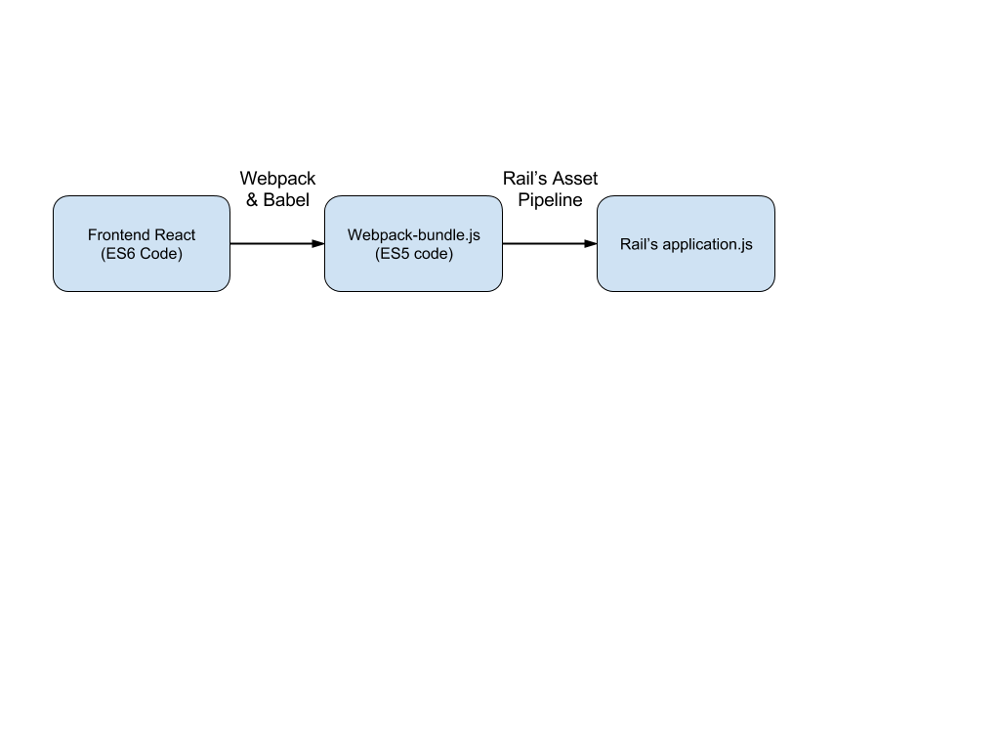

# Caseflow Frontend

## About

Caseflow's frontend is built using React & Webpack. React is the framework we use to organize our frontend code into reusable, extensible components. Rails still handles all web routing, and determines when react components should be rendered.

## Asset Compilation Process

The frontend code is compiled using [Webpack](https://webpack.github.io/) & [Babel](https://babeljs.io/). The webpack takes `client/app/index.js` as its input file, and after compilation outputs the resulting javascript file to `app/assets/webpack/webpack-bundle.js`. During compilation, the frontend code goes through two key transformations. First, the initial ES6 JS frontend code is transformed into ES5 (supported in all browsers today). Second, the HTML-like JSX code is transformed into pure JS. By performing these transformations, the resulting `webpack-bundle.js` is pure ES5 JS that is ready for use by Rail's asset pipeline.

## Adding a New JS Library

Caseflow's frontend uses npm (Node Package Manager) to manage its JS dependencies. Similar to Rail's Gemfile, the frontend manages its dependencies via a `package.json` file located in `/client`. You can search for JS libraries on [NPM's website](https://www.npmjs.com/). To add a new dependency:

> $ npm install <new-library> --save

Ensure the dependency management file  (npm-shrinkwrap.json) is updated:

> $ npm shrinkwrap

If you run into any errors with extraneous files run:

> $ npm prune

Please make sure to commit changes to the package.json and npm-shrinkwrap.json together.

## Styling

CSS styling continues to be handled by Rails and the asset pipeline. To add new styling:

- Open the relevant file in `app/assets/stylesheets`
- Add new styling as needed
- Reload the page

## Testing

Frontend unit tests are run using [Mocha](https://mochajs.org/). All [reusable components](components) should have mocha unit tests. [Containers](containers) (e.g. page top-level components) should limit mocha tests to only verifying interactivity. Beyond that, feature-level tests should continue to be added using Capybara. For more information on mocha tests, see example component tests in [/test](test).
