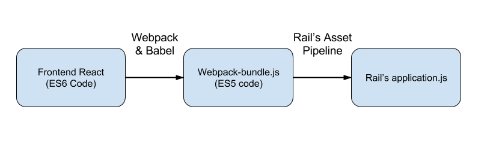

# Caseflow Frontend

## About

Caseflow's frontend is built using React & Webpack. React is the framework we use to organize our frontend code into reusable, extensible components. Rails still handles all web routing, and determines when react components should be rendered.

Be sure to install the [Redux DevTools browser extension](https://chrome.google.com/webstore/detail/redux-devtools/lmhkpmbekcpmknklioeibfkpmmfibljd?hl=en) for full debugging support on the parts of the app that use Redux and integrate with the dev tools.

To use the proper version of NodeJS to build this project, install [nvm](https://github.com/creationix/nvm). Then follow nvm's instructions to use the version of NodeJS specified in the `.nvmrc` in this directory.

## Asset Compilation Process

The frontend code is compiled using [Webpack](https://webpack.github.io/) & [Babel](https://babeljs.io/). The webpack takes `client/app/index.js` as its input file, and after compilation outputs the resulting javascript file to `app/assets/webpack/webpack-bundle.js`. During compilation, the frontend code goes through two key transformations. First, the initial ES6 JS frontend code is transformed into ES5 (supported in all browsers today). Second, the HTML-like JSX code is transformed into pure JS. By performing these transformations, the resulting `webpack-bundle.js` is pure ES5 JS that is ready for use by Rail's asset pipeline.

## Adding a New JS Library

Caseflow's frontend uses yarn to manage its JS dependencies. Similar to Rail's Gemfile, the frontend manages its dependencies via a `package.json` file located in `/client`. You can search for JS libraries on [npm's website](https://www.npmjs.com/). To add a new dependency:

> \$ yarn add <new-library>
> Please make sure to commit changes to the `package.json` and `yarn.lock` together.

The version of `yarn` we use is set in `.travis.yml`. 

* [Yarn Getting Started](https://yarnpkg.com/en/docs/getting-started)
* [Yarn Installation](https://yarnpkg.com/en/docs/install)
* [Yarn migrating from npm](https://yarnpkg.com/lang/en/docs/migrating-from-npm/)

### Deps v. devDeps

Dependencies needed to build the frontend JS go in `dependencies`, not `devDependencies`. `devDependencies` are only for running JS tests.

## Styling

CSS styling continues to be handled by Rails and the asset pipeline. To add new styling:

- Open the relevant file in `app/assets/stylesheets`
- Add new styling as needed
- Reload the page

## Testing

Frontend unit tests are run using Jest and Karma. All [reusable components](components) should have unit tests. [Containers](containers) (e.g. page top-level components) should limit Jest tests to only verifying interactivity. Beyond that, feature-level tests should continue to be added using Capybara. See example component tests in `/test/app`.