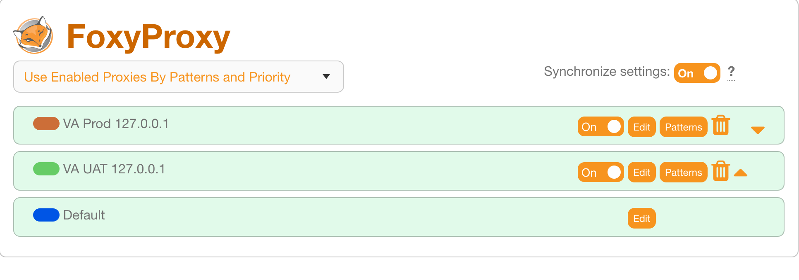
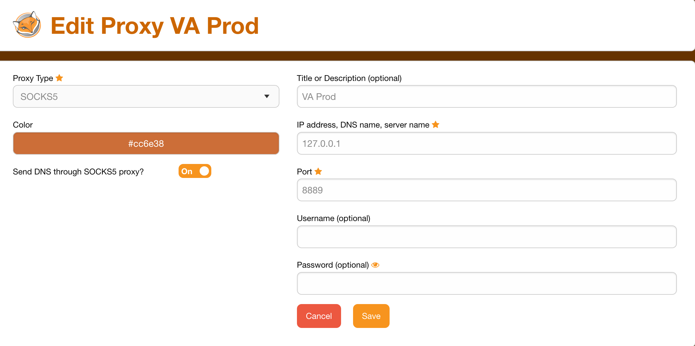

# Connect to Jumpbox

The following describes how to set up a SOCKS proxy server on your local machine.

1. Create a new SSH key using `ssh-keygen` in your `~/.ssh` folder. Use a password.

2. Add your SSH keys to the Jumpbox servers. Basically, you just need to make 2 PRs like these:
-a- https://github.com/department-of-veterans-affairs/appeals-deployment/pull/2096
-b- https://github.com/department-of-veterans-affairs/devops/pull/4834

3. Contact a member of the DevOps team and ask them to review your 2 pull requests and to run the Ansible job which will add your SSH keys to the Jumpbox servers.

3. Set up an `~/.ssh/config` file like this (replace User and IdentityFile values with your own)
```
# General settings
Host *
        StrictHostKeyChecking no
        ForwardAgent yes
        Compression yes
        ServerAliveInterval 15
        ServerAliveCountMax 4
        UserKnownHostsFile /dev/null
        User kmoore
        Port 22

# Tista and the VA
Host stage
        HostName 52.61.187.248
        IdentityFile ~/.ssh/id_rsa_tista_va
        ForwardAgent yes
        DynamicForward 8888
        GatewayPorts yes

Host stage+*
        IdentityFile ~/.ssh/id_rsa_tista_va
        ControlMaster auto
        ProxyCommand ssh -T -A $(echo %h |cut -d+ -f1) nc $(echo %h |cut -d+ -f2) %p 2>/dev/null
        StrictHostKeyChecking no

Host prod
        HostName 52.222.110.120
        IdentityFile ~/.ssh/id_rsa_tista_va
        ForwardAgent yes
        DynamicForward 8889
        GatewayPorts yes

Host prod+*
        IdentityFile ~/.ssh/id_rsa_tista_va
        ControlMaster auto
        ProxyCommand ssh -T -A $(echo %h |cut -d+ -f1) nc $(echo %h |cut -d+ -f2) %p 2>/dev/null
StrictHostKeyChecking no
```

4. Run an SSH connection:
`ssh stage`
`ssh prod`

These will be proxying to ports 8888 and 8889 respectively.

Some handy aliases for those who will be connecting frequently:
# SOCKS proxy shortcuts
`alias proxprod='ssh prod -T -D18080`
`alias proxuat='ssh uat -T -D10080`

5. Download the FoxyProxy plugin for Firefox or Chrome.

6. Configure 2 SOCK5 proxy rules on FoxyProxy. The order of the rules matters.





7. As long as you are connected to SSH, you should now be able to navigate to Sentry links on the VA network and sign in.
