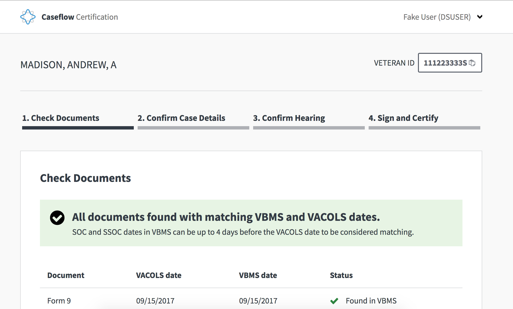

# What is Caseflow Certification?

Caseflow Certification is a web-based tool that pre-fills the electronic Form 8 for paperless appeals and checks case documents for readiness for certification.

## About

Clerical errors have the potential to delay the resolution of a veteran's appeal by **months**. Caseflow Certification uses automated error checking, and user-centered design to greatly reduce the number of clerical errors made when certifying appeals from offices around the nation to the Board of Veteran's Appeals in Washington DC.

[You can read more about the project here](https://medium.com/the-u-s-digital-service/new-tool-launches-to-improve-the-benefits-claim-appeals-process-at-the-va-59c2557a4a1c#.t1qhhz7h8).

## Certification (Dev Mode)

To log in, you can use the following credentials:

Username: "DSUSER"
Password: "DSUSER"

To get to the various pages in the workflow we have a set of five URLs of dummy data.

[http://localhost:3000/certifications/new/123C](http://localhost:3000/certifications/new/123C) is an appeal that is ready to certify.
[http://localhost:3000/certifications/new/456C](http://localhost:3000/certifications/new/456C) is an appeal with mismatched docs.
[http://localhost:3000/certifications/new/789C](http://localhost:3000/certifications/new/789C) is an appeal that is already certified.
[http://localhost:3000/certifications/new/000ERR](http://localhost:3000/certifications/new/000ERR) is an appeal that raises a vbms error.
[http://localhost:3000/certifications/new/001ERR](http://localhost:3000/certifications/new/001ERR) is an appeal that is missing data.

## Changing between test users

Select 'Switch User' from the dropdown and select 'Certify Appeal at 283' or navigate to
[http://localhost:3000/dev/users](http://localhost:3000/test/users). You can use
this page to switch to any user that is currently in the database. The users' names specify
what roles they have and therefore what pages they can access. To add new users with new
roles, you should seed them in the database via the seeds.rb file. The css_id of the user
should be a comma separated list of roles you want that user to have.

This page also contains links to different parts of the site to make dev-ing faster. Please
add more links and users as needed.

## Running tests

To run the test suite:

    rake

### Running unit tests

 To run a test that starts certification as a user who is not logged in, a user who is not authorized to login, a user who is authorized to login:

     bundle exec rspec spec/feature/certification/start_certification_spec.rb

To run tests for save Certification as an authorized user, save certification data in the database, confirm validation works:

     bundle exec rspec spec/feature/certification/save_certification_spec.rb 

 To run tests for the CertificationV2 Stats Dashboard:

    bundle exec rspec spec/feature/certification/certification_v2_stats_spec.rb

 To run tests for the Certification Stats Dashboard:

     bundle exec rspec spec/feature/certification/certification_stats_spec.rb

 To run tests to cancel certification as authorized user:

      bundle exec rspec spec/feature/certification/cancel_certification_spec.rb

