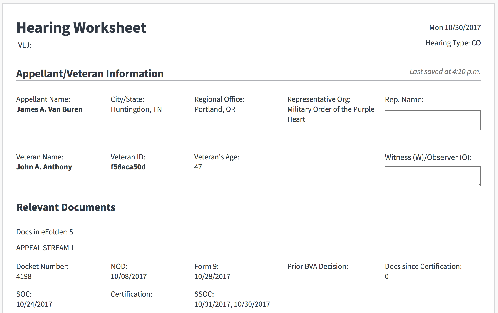

# What is Caseflow Hearing Prep?

Caseflow Hearing Prep is a web application that allows judges to prepare for hearings more quickly. It pulls relevant information in from BGS and VACOLS and provides a worksheet for the judge to fill out before each hearing.

## Accessing Hearing Prep (Dev Mode)

To log into Hearing Prep from the welcome gate page, please follow the following steps:

1. On 'User Selector' dropdown menu, select Hearing Prep at 283.

1. Click the 'Switch user' button.
 
1. On the 'App Selector' tab, Select Hearing Prep. 

1. Select Upcoming Days.

## Supported Browsers

- Chrome

## Supported Screen Size

- 1280 x 800 resolution