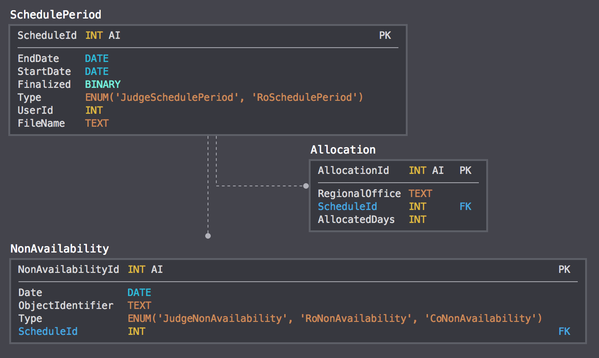

This document was moved from [appeals-team](https://github.com/department-of-veterans-affairs/appeals-team/blob/main/Project%20Folders/Caseflow%20Projects/Hearings/Hearing%20Schedule/Tech%20Specs/HearingSchedule.md).

## Caseflow Hearing Schedule

Owner: Sharon Warner
Date: 2018-05-18
Reviewer(s):
Review by:

## Context

While previously handled by ROs, the AMA legislation requires that BVA schedules veterans' hearings. We are creating Caseflow Hearing Schedule to help the Board with that process.

**Hearings Scheduling Functionality**
1) assigning video hearing days to ROs and central office hearing days to the Board,
1) assigning the video and central office hearing days to judges,
1) editing the hearing day's RO or judge,
1) slotting veterans into the hearing days,
1) adding hearing days,
1) viewing the schedule and filtering on type, date range, judge, & RO, and
1) exporting reports for board leadership.

By December, we will build the hearings scheduling functionality as described above. As part of a separate effort to deprecate VACOLS, we are also going to move the source of truth for hearings-related data to Caseflow.

## Overview - August Release

Creating the video hearings schedule is currently a very manual process done by the hearing coordinators involving three steps.

First, they collect non-availability days from ROs, the board, and judges. These include federal holidays, vacation days, training days, VSO retreats, etc. They collate this information into a spreadsheet.

Second, they determine the hearing day allocation across ROs. This allocation is based on the number of veterans who are ready for a hearing at each RO that are within a set date range. The date range is set far enough in the past that veterans can expect a decision soon after the completion of their hearing. If, for example, we are scheduling hearings for veterans whose cases are dated before December 31st 2013, and Pittsburgh's RO office has 22 veterans ready for hearings whose appeals are dated in the correct time range, Pittsburgh will be allocated 2 hearing days. This information is also collated in a spreadsheet.

Third, using the information collected above, the hearing coordinators assign hearing days to ROs, and then assign those hearing days to judges.

On August 1st, our first release, Caseflow will take over the functionality for the third step of the process. We will also release a very simple UI to allow hearing coordinators to download a template spreadsheet, upload hearings allocation and non-availability information in the spreadsheet, view the schedule, and download previously uploaded spreadsheets.

The hearing coordinators will continue to create and upload the schedule for travel board hearings, upload slots for central office hearings, determine how many video hearing days each RO will be assigned, and collect information from ROs, judges, and the Board regarding their non-availability.

Central office hearings are handled slightly differently. Currently Jed uploads 12 slots for each day the Board is available to hold hearings. However, veterans are only scheduled for Wednesdays. After the August release, Jed will continue to upload the slots, but we will assign one judge for every Wednesday.

ROs will continue to use VACOLS to slot veterans.

If there is extra development time before the August release, the following features that are currently done through VACOLS can be added to Caseflow.

1) Adding hearing days
1) Editing a hearing's assigned RO or judge
1) Exporting reports
1) Filtering the schedule view

**Algorithm**

Currently, the hearing coordinators use the non-availability days and the allocation numbers to manually assign hearing days to ROs, and then judges to those hearing days. We are going to automate that process.

Consider, for example, these inputs: Philadelphia is allocated 2 hearing days, St Petersburg is allocated 12 hearing days, we're scheduling hearing days for January 1st through June 30th, Philadelphia is unavailable for the entire month of February, St Petersburg is unavailable the 10th of every month, and the Board is closed for all federal holidays. We could assign January 15th and April 15th to Philadelphia, and the 5th and 20th of every month to St Petersburg.

We will have a similar process for judges, on a quarterly basis. Each judge is required to have 2.5 hearing days per month, or 2 one month and 3 the next.

**Inputs**

Because of the tight deadline, and the amount of data we need to input, we're going to simplify our UI and create spreadsheets for the hearing coordinators to upload. There will be four spreadsheets:

1) RO non-availability dates
1) Board non-availability dates
1) Hearings allocation
1) Judge non-availability dates

The RO non-availability dates, board non-availability dates, and hearings allocation will be uploaded together semi-annually, and the judge non-availability dates will be uploaded separately quarterly. The spreadsheet templates can be found [here](https://github.com/department-of-veterans-affairs/appeals-team/tree/main/Project%20Folders/Caseflow%20Projects/Hearings/Hearing%20Schedule/Designs).

We will pull already-scheduled video and central office hearings and travel board hearings from VACOLS.

## Overview - December Release

By December 1st, we will release the functionality to slot veterans into hearing days and complete the migration from VACOLS to Caseflow (including any of the extra features we did not have time to complete by August).

## Out of Scope

The following features are out of scope for 2018.

1) Travel board RO assignments
1) Travel board judge assignments
1) Uploading central office hearing slots to VACOLS

## Open Questions

## Implementation

**Data Structures (May)**

Each time a user uploads a spreadsheet, we'll validate the information using the process described below. If the validations pass, we'll create a corresponding entry in SchedulePeriod with the dates the user provides. When the user confirms that the assignments the algorithm builds should be uploaded to VACOLS, we'll set Finalized to true. The type will be set to either 'RO' or 'JUDGE' based on which spreadsheet the user is uploading.

The NonAvailability table will include information for all three types of non-availability days. For judge non-availability days, the type will be set to 'JUDGE', and ObjectIdentifier will be foreign-keyed to the users table. For CO non-availability days, the type and the ObjectIdentifier will be set to 'CO'. For RO non-availability days, the type will be set to 'RO', and the ObjectIdentifier will be set to 'ROxx'.

**CSV Validations (May)**

*Overall*

Each time a valid spreadsheet is uploaded, we'll record the dates that spreadsheet covers in SchedulePeriods. If a user uploads a second spreadsheet of the same type that covers date that have already been uploaded, we'll check to see if Finalized for the original spreadsheet is true or false. If Finalized is true, that means the information has already been uploaded to VACOLS, and we'll tell the user that they cannot re-upload a spreadsheet for those dates. If Finalized is false, we'll tell the user that they have already uploaded a spreadsheet for those dates and ask if they want to proceed. If the user wants to proceed, we'll delete all information associated with the original spreadsheet and then upload the new spreadsheet.

We'll also check the following validations for each spreadsheet. If the uploaded spreadsheet breaks any of these validations, we'll ask the user to fix the error and re-upload the spreadsheet.

1) The headers much match the template exactly.
1) All dates should all be in this format: mm/dd/yyyy.
1) All dates should be within the date range specified by the hearing coordinator.

*RO Non-Availability*

1) All BFREGOFF codes should match the city, state we have listed in regional_office.rb.
1) Every RO listed in regional_office.rb should have a column.
1) The dates listed for each RO should be unique.

*CO Non-Availability*

1) The dates should be unique.

*Judge Non-Availability*
1) The CSS id and judge name should match what we already have stored in our database.

*Hearing Allocations*

1) All BFREGOFF codes should match the city, state we have listed in regional_office.rb.
1) Every RO listed in regional_office.rb should have a row.

**User Permissions (May)**

The hearing coordinators will have a function titled, "Build HearSched". This provides us the flexibility to eventually give RO employees a function titled, "View HearSched" and employees who slot veterans, "Edit HearSched".

**URLs (June)**

- /hearings/schedule - shows the entire schedule (eventually with appropriate filters and searches)
- /hearings/schedule/edit - flow for editing hearings and slotting veterans
- /hearings/schedule/build - flow for uploading spreadsheets and uploading new hearings and judge assignments to VACOLS

**Spreadsheet Integrations (June)**

*Downloading Spreadsheets*

The templates and previous iterations of uploaded spreadsheets will be available for download on the hearing coordinator homepage. The templates, because they may occassionally need to be modified, will be stored in the repository. Their names are JudgeAssignmentTemplate.xlsx and ROAssignmentTemplate.xlsx. Previous iterations of uploaded spreadsheets will be stored in S3. Their names in S3 will be JudgeAssignmentTemplate<time_stamp>.xlsx and ROAssignmentTemplate<time_stamp>.xlsx. When users download the spreadsheets, we will rename them JudgeAssignmentTemplate<start_date>-<end_date>.xlsx and ROAssignmentTemplate<start_date>-<end_date>.xlsx

*Uploading Spreadsheets*

Through our UI and the Javascript AWS-SDK library, the hearing coordinators will upload the spreadsheet to S3. Once the upload has completed, we will send a request to the backend with the spreadsheet dates and the S3 location. We will read and validate the file using a Ruby gem [roo-rb/roo](https://github.com/roo-rb/roo). Once validation passes, we'll save the data to the database.

*S3 Integration*

We'll create two new buckets within the dsva-appeals-caseflow-prod bucket to store previously uploaded hearing spreadsheets. The JudgeAssignment spreadsheets will be uploaded to hearing-schedule/judge-assignment and the ROAssignment spreadsheets will be uploaded to hearing-schedule/ro-assignment.

**RO Assignment Algorithm (June)**

1. Fetch all available calendar working days excluding the federal holidays
2. Filter out the Board unavailable days from the working calendar days, since no hearing can be held that day.
3. Gather the RO non-availablity days for each RO
    1. 1st source is the CSV uploaded with RO non-availablity days
    2. 2nd source is the travel board dates fetched from VACOLS
4. Divide the number of hearing days for each RO by the number of months selected in the timeframe. (RO1: 12 for 6 months ) -> 2 days per month.
    1. It’s preferred to have RO hearing days distributed among the selected months (example:  if an RO has 2 hearing days; it’s preferred to have each hearing day distributed among different months)
    2. A priority is given for ROs that have multiple rooms available since they can hold more hearings per day
    3. It’s preferred to have whole number hearing days even if the hearing days cannot be evenly distributed ~ (if an RO has 25 hearing days, 25/6 = 4.16, each month shall have at least 4 hearing days for this RO and the remainder of days can be distributed among random months selected based on the calendar days available to the RO).
    4. If the RO hearing days cannot be distributed evenly among the selected months due to increased non-availability days for the month, the remaining hearings are distributed through out the other months based on the available calendars days for the RO)
5. Select a random RO available date in the month to assign each of the divided RO hearing days.
    1. If the RO has has more than 1 room available, every room at the RO must be assigned a RO hearing day
6. There is a cap on the number of RO days that be can be assigned per each board available day due to the amount of video hearing rooms available at the board (room # 4-10 -> The cap is 10)
7. If there are half hearing days available for individual ROs, it’s preferred to combine them into a whole ‘Shared’ day (Two half days be be combined into one shared day, for which 1 judge can be assigned).

Example error:
1. [RO name(s)] cannot be allocated the number of hearing days provided in the spreadsheet.

**VACOLS Integrations (June)**

To support the requirements to create and modify hearing schedule master records Caseflow will be able to perform the following operations against the VACOLS database:

1. Create a row in the HEARSCHED table with minimal information, such as hearing_type, hearing date, room number, and Regional Office (video hearings only).
2. Update a row in the HEARSCHED table for a Regional Office and hearing date to add the VLJ information, and whatever other attributes are needed when assigning a judge to a hearing date.
3. Cancel a hearing by updating a specific row in the HEARSCHED table. UI will most likely pass the hearing PK id to identify the row to be updated.
4. Query to get all master hearing records scheduled for a specified date range.

All of the above operations to be implemented in the existing VACOLS::CaseHearing model. The Caseflow database, and Hearing model, will not persist any information. It all goes straight to VACOLS.

To support querying for Travel Board hearings we need to add the following operations to the VACOLS::TravelBoardSchedule model:

1. Query for all master hearing records for a specified date range.
2. Update the members assigned to a travel board date, as well as related information. Members may include judges, attorneys and other supporting personnel.

**Judge Assignment Algorithm (July)**

1. Fetch all RO hearing days allocated to available calendar days
2. Gather all judge non-availablity days
    1. 1st source is the CSV uploaded with Judge non-availablity days
    2. 2nd source is the Travel Board dates for each individual judge
    3. 3rd source is the CO days assigned for each individual judge
3. Match the available RO hearing days with the judge available days, making sure there are no conflicts
    1. Each judge is allocated about 6-7 hearing days per quarter
    2. If a judge is on a travel board, it’s for an entire week
        1. No RO hearing days can be allocated to that judge a week prior or after the travel board week.

Notes:
There are three options for allocating judges:

1. Shuffle the judges and allocate the hearing days one at a time to all the judges (It doesn't verify complete balance, since it's randomized for the current scheduled period)
2. Fetch all hearing days for all judges for the current federal fiscal year, allocate the hearing days to initially to the judges with the least amount of hearings to make sure the hearing days are evently distributed to all judges.
3. Fetch other factors such as case assignments and years of expereince of all judges, use these factors to calculate a constant value for each judge to be multiplied to (total number of hearing days / number of judges). A remainder counter is used for each judge to carry over the net -/+ value for each quarter of the fiscal year. These tallys are zeroed at the end of the fiscal year.

***We are choosing option 1 for the August 1st launch, we shall re-evaluate the other 2 options in the near future.***

Example error:
1. There are too many blackout days for (#) of hearing days to be allocated within the schedule period.

[**Move from VACOLS to Caseflow**](2018-06-21-vacols-caseflow-transition.md)

**Slotting Veterans (December)**

## Rollout Plan

**August Rollout**

Unfortunately, the hearing coordinators are required to build the schedule for the first six months of FY2019 before our August 1st roll-out date. However, the hearing coordinators will use Caseflow to assign those hearing days to judges and to build the schedule for the second six months of FY2019.

We will also create a test case that the hearing coordinators can use to create a mock hearing schedule for the first six months of FY2019. They can compare this mock schedule to the schedule they have already manually created to confirm the scheduling is working as expected.

**December Rollout**

## Research Notes

- [URL Discussion](https://github.com/department-of-veterans-affairs/caseflow/issues/5706)
- [User Permissions Discussion](https://github.com/department-of-veterans-affairs/caseflow/issues/5660)

