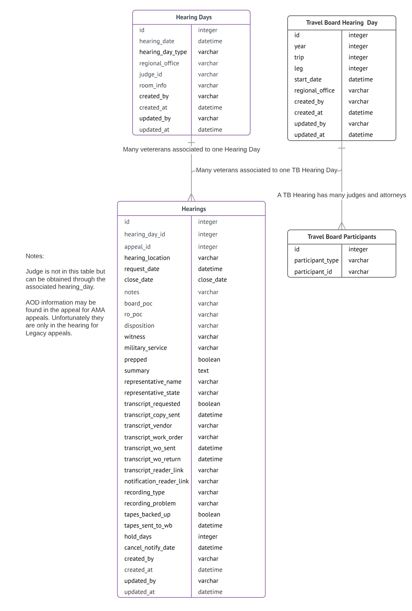

This document was moved from [appeals-team](https://github.com/department-of-veterans-affairs/appeals-team/blob/main/Project%20Folders/Caseflow%20Projects/Hearings/Hearing%20Schedule/Tech%20Specs/VacolsCaseflowTransition.md).

## VACOLS to Caseflow Transition

Owner: Oscar Ramirez
Date: 2018-06-21 (Updated 2018-08-08)
Reviewer(s): Sharon Warner, Alex Prokop
Review by:  2018-08-13

## Context
Once the AMA legislation goes live on February 14, 2019 the Board will assign appeals to specific hearing days, taking over a task performed by regional offices today. This technical specification outlines the events that need to take place to make this transition of responsibilities as smooth as possible

## Overview
AMA appeals are any appeals processed under the workflow defined by the new legislation. AMA appeals will be processed exclusively in Caseflow, while Legacy appeals will continue to be stored in the VACOLS database. New Legacy Appeals may continue to flow into the system after February of 2019 as Veterans have up to a year to appeal a claim.

For the August 2018 release of the Hearing Schedule product the calendar of hearing days allocated to regional offices will be stored in VACOLS. Regional offices will continue to manage slotting appeals to hearing days using the VACOLS UI.

When the AMA legislation is in place the calendar of hearing days will be stored in Caseflow, as will AMA appeals, and the Board will schedule both AMA and Legacy Veteran appeals using the Caseflow UI.

**Travel Board Hearings**

This hearing type is discontinued for AMA appeals but we need to continue to support it while there are legacy appeals that chose this hearing in the system.

A Travel Board Hearing Schedule is very different than the next two types of hearings. They are organized in trips that last several days. Each trip has one or more participants. The participants are one or more judges, and possibly one or more attorneys.

**Central Office Hearings**

These hearings will continue with the AMA legislation. The Veteran travels to the Board's headquarters to see a judge. These hearings are currently only held every Wednesday although a calendar is created for all business days of the year.

**Video Hearings**

These hearings will continue with the AMA legislation. The Veteran travels to a location close to where they live. It may be the regional office, or a Veteran Administration facility, such as a hospital. The latter are know as 'Alternate Hearing Locations'.

The Board allocates a certain number of hearing days for a Fiscal Year to each regional office based on the number of appeals requiring hearings.

The ER diagram below highlights the different data attributes for each hearing type.

## Data Model Implementation
The data model displayed above will be implemented in the Caseflow Postgres database. The appropriate changes will have to be made to the Hearing Schedule code to read and write into this new model. Any view that lists the hearing schedule calendar, or appeals scheduled to hearings, will have to merge the data in the VACOLS and Caseflow databases. The system will need a record type defined so the back-end knows whether the data sent from the UI is Legacy or AMA.

Regional office personnel will require a view, in Caseflow, of this consolidated data to coordinate the Veteran's visit to the location where the hearing will be held. VSO representatives will also require a view to manage their schedule.

## Timeline

*August 2018*
- Hearing coordinators create parent records (hearing days) for video hearings for October 1st, 2018 - March 31st, 2019 with the Caseflow UI but the records are stored in the VACOLS database. (Update: first half of FY 2019 calendar was created using VACOLS as the Board management wanted to create it before August.)
- Hearing coordinators assign judges to the calendar days created for October 1, 2018 to December 31, 2018 using the Caseflow UI. The UI uses the Judge Algorithm to assign judges to hearings, which accounts for judges' non-availability days.
- ROs continue to slot veterans for video hearings for October 1st, 2018 - March 31st, 2019 through the VACOLS UI
- ROs continue to manage veterans arriving for their video hearings through the VACOLS UI

*December 2018*
- Hearing coordinators assign judges to the calendar days January 1, 2019 to March 31, 2019 using the Caseflow UI.

*February 2019*
- Hearing coordinators create parent records (hearing days) for video hearings for April 1st, 2019 - September 30th, 2019 in Caseflow. The resulting calendar is stored in the Caseflow database.
- Hearing coordinators assign judges to the calendar days April 1, 2019 to June 30, 2019 using the Caseflow UI.
- Hearing coordinators slot Legacy and AMA Veteran appeals for video hearings for April 1st, 2019 - September 30th, 2019 using Caseflow.
- ROs continue to manage veterans arriving for their video hearings through the VACOLS UI

*April 2019*
- ROs manage veterans arriving for their video hearings through Caseflow

## What Stays In VACOLS UI
- Travel Board Hearings will continue to use the VACOLS UI for scheduling until FY 2020. AMA appeals do not have the option to select an Travel Board hearing.
- The management of transcriptions for any hearing held prior to April 1, 2019.
- Updates to any hearing details for hearings scheduled prior to April 1, 2019.

## Notification Letters
We will propose to store only the link to the VBMS copy of the notification letter sent to the appelant. Caseflow will not store any attachments nor hav references to shared drives.
Caseflow will not create the notification letter nor store it in a shared drive. The hearing coordinators will have to develop a procedure to create the letter from a template, fill the data from Caseflow, and store it in a central shared drive.

## Transcriptions
The recording devices used in hearings store the audio in a specific shared drive. These raw audio files currently are batched and sent to the transcription vendor via another shared drive location. Raw audio files are separated into two separate directories, one for video hearings and one for travel board hearings. The VACOLS UI has two windows to manage the batching of audio files to work orders.

Once AMA hearings start, the audio files for these hearings may have to be stored in a third directory in the shared drive as to not affect the existing functionality. Furthermore Caseflow will need to design a process to be able to take these audio files and generate work-orders from them. We can either provide screens to do the batching or create a task with instructions so hearing coordinators do the batching manually.

## Reports
The Hearing Management team is reviewing the existing reports to let us know which continue to be valid and need migration to Caseflow. Their review is ongoing as of this writing. A cursory review of the applications used by the Regional Offices and by Hearing Management reveals the following reports. There may be more but these are the obvious ones directly dealing with hearings data.

vclrpts app
Custom Rpts --> CO, Travel Board, Video Request Summary
Annual Rpts -->  BVA Hearings Held

Vacols3 app
Hearings --> Video Hearings
Hearings --> Travel Board Hearings
Hearings --> CO Hearings

Roaccess
Hearings --> Travel Board Requests
Hearings --> Formal Hearings Pending
Hearings --> Formal Hearing Disposition Detail
Hearings --> Forman Hearing Disposition Summary
Hearings --> Certified BVA Awaiting Travel Board
Hearings --> BVA VLJs --> Update Travel Board Docket
Hearings --> BVA VLJs --> Update Video Docket           <-- Are these used by VLJs or Hearing Coordinators?
Hearings --> BVA VLJs --> Update / Print CO Docket
Hearings --> View/Print Virtual TB or Video Docket

Mgmt Rpts --> BVA Hearing Schedule (TB, Video, CO)
Mgmt Rpts --> BVA Hearing Disposition Summary by RO

**NB: Outcome of Hearing Management report review may affect the data model as additional attributes may need to be associated with either individual hearings or the schedule.**

## Discussion Meetings and Outcomes

## August 29, 2018

- Merge Central Office and Video Hearing Day into one table and move hearing_type to consolidated table.
- appeal_id - how do we associate to both LegacyAppeal and Appeal models.
- How is team assigned? Do we need it? In VACOLS UI the team field is populated based on what is on the staff table for the judge.
- Remove veteran_id as this information can be fetched from the appeal.
- Remove media_type? For hearings since September 2017 there were 25 which used cassette tape.
- Rename media_problem to recording_problem.
- Rename hold_days_vlj to hold_days. Does it generate an alert after n days?
- Separate hearing prep data from hearings data? When appeal is rescheduled do we want to keep the hearings detail data? We would move the hearings row and associate it with another HearingDay row.

