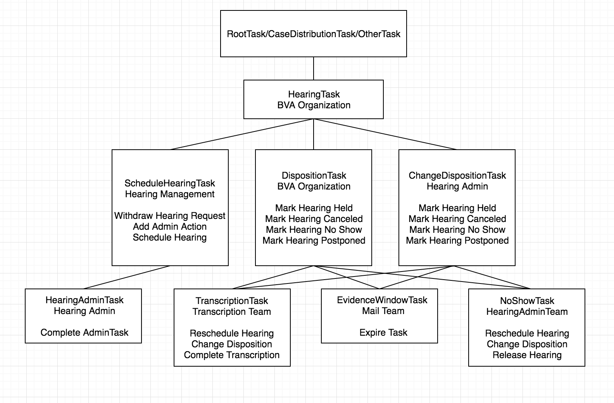

This document was moved from [appeals-team](https://github.com/department-of-veterans-affairs/appeals-team/blob/main/Project%20Folders/Caseflow%20Projects/Hearings/Hearing%20Schedule/Tech%20Specs/HearingTaskFlow.md).

## Hearing Task Flow

Owner: Sharon Warner
Date: 2019-01-28
Reviewer(s):
Review by:

## Task Hierarchy

## Legacy Appeal Flow

***Incoming appeals***
1) During the AHL job, we create a HearingTask off of the Root Task, a ScheduleHearingTask off of the HearingTask, and move the VACOLS location to 'Caseflow' for any appeal found in location 57 that has requested a video or CO hearing and does not already have an open hearing.

***Withdrawn Hearing Request (No Hearing Scheduled) Flow***
1) The user cancels the ScheduleHearingTask, the Hearingtask is automatically closed, and we move the appeal to location 81 (case storage) or 55 (if VSO or co-located)

***Scheduling a Hearing***
1) When a hearing is scheduled, we complete the ScheduleHearingTask and create a DispositionTask off of the HearingTask

***Canceled Hearing Flow***
1) We close the DispositionTask, the HearingTask is automatically closed, and we move the appeal to location 81 (case storage) or 55 (if VSO or co-located)

***Postponed Hearing Flow***
1) If user immediately reschedules, we close the existing DispositionTask, the HearingTask is automatically closed, and we create a new HearingTask and new DispositionTask
1) If user can't immediately reschedule, we close the existing DispositionTask, the HearingTask is automatically closed, and we create a new HearingTask and new ScheduleHearingTask
1) If a user needs an admin action, we close the existing DispositionTask, the HearingTask is automatically closed, and we create a new HearingTask, ScheduleHearingTask, and HearingAdminTask

***Held Hearing Flow***
1) We close the DispositionTask, the HearingTask is automatically closed, and we move the appeal to location 33 (transcription)

***No Show Hearing Flow***
1) We create a NoShowHearingTask as a child of the DispositionTask that expires in 25 days
1) If the user selects 'Mark as complete: released case for review', we close the NoShowHearingTask, the DispositionTask and HearingTask are automatically closed, and we move the appeal to 81 (case storage) or 55 (if VSO or co-located)
1) If the user selects 'Mark as complete and postpone', we close the NoShowHearingTask, the DispositionTask and HearingTask are automatically closed, and we create a new HearingTask and ScheduleHearingTask
1) If the user selects 'Edit disposition', we close the NoShowHearingTask, the DispositionTask is automatically closed, and we create a ChangeDispositionTask off the HearingTask

## AMA Appeal Flow

***Incoming appeals***
1) During intake, a HearingTask will be created off the CaseDistributionTask and a ScheduleHearingtask will be created off the HearingTask for any appeal in the hearings lane

***Withdrawn Hearing Request (No Hearing Scheduled) Flow***
1) The user cancels the ScheduleHearingTask and the HearingTask is automatically closed

***Scheduling a Hearing***
1) When a hearing is scheduled, we complete the ScheduleHearingTask and create a DispositionTask off of the HearingTask

***Canceled Hearing Flow***
1) We cancel the DispositionTask and the HearingTask is automatically closed

***Postponed Hearing Flow***
1) If user immediately reschedules, we close the existing DispositionTask, the HearingTask is automatically closed, and we create a new HearingTask and DispositionTask
1) If user can't immediately reschedule, we close the existing DispositionTask, the HearingTask is automatically closed, and we create a new HearingTask and ScheduleHearingTask
1) If a user needs an admin action, we close the existing DispositionTask, the HearingTask is automatically closed, and we create a new HearingTask, ScheduleHearingTask, and HearingAdminTask

***Held Hearing Flow***
1) We create a TranscriptionTask and an EvidenceWindowTask that expires in 90 days if the evidence window wasn't waived as children of the DispositionTask
1) If the user selects 'Edit disposition', we close the TranscriptionTask, the DispositionTask and its children are automatically closed, and we create a ChangeDispositionTask off the HearingTask

***No Show Hearing Flow***
1) We create a NoShowHearingTask as a child of the DispositionTask
1) If the user selects 'Mark as complete: released case for review', we close the NoShowHearingTask and the DispositionTask and HearingTask are automatically closed
1) If the user selects 'Mark as complete and postpone', we close the NoShowHearingTask, the DispositionTask and HearingTask are automatically closed, and we create a new HearingTask and ScheduleHearingTask
1) If the user selects 'Edit disposition', we close the NoShowHearingTask, the DispositionTask and its children are automatically closed, and we create a ChangeDispositionTask off the HearingTask

## Disposition Task

While most of the hearings associated tasks can be completed through the queue framework, the disposition task can only be completed through either the hearing prep daily docket or the hearing schedule daily docket. Because users may not understand the consequences of selecting dispositions on these pages, we will put safeguards in place to ensure we're not unnecessarily creating and deleting tasks.

***Disposition Job***
When a user marks a hearing as canceled, no show, or held, we will immediately save the disposition to the hearings table, but we will not take any task actions to move the appeal forward. The disposition will remain editable in the UI.

We will create an overnight job to pull in all appeals with 1) open DispositionTasks that are not on hold, and 2) a hearing with a disposition that was not held that day (hearing coordinators and judges regularly update dispositions the day after a hearing was schedule). This job will perform the necessary actions described above to move appeals forward.

***Postponed Hearings***
When a user marks a hearing as postponed, we will both mark the hearing as postponed in the database and immediately create the necessary tasks to move the appeal forward. We are differentiating this case because postponing a hearing can require immediate action on the resulting tasks from the hearings management branch.

***UI***
The hearing prep and hearing schedule daily dockets will be updated such that the hearing dispositions are only editable if either 1) the appeal's DispositionTask is open and not on hold or 2) the appeal does not have a DispositionTask (legacy hearings scheduled prior to 2/1). We will also remove the autosave feature from the hearing prep daily docket and implement a save button.

## VACOLS Locations for Legacy Appeals

***Appeals in Location 57***
We will run a job to continuously move appeals from location 57 to Caseflow. There should never be any appeal in location 57 that 1) has requested a video or CO hearing and 2) does not have an open hearing, for more than an hour.

***Appeals in Locations 36/38***
The hearings management branch will need to move appeals out of locations 36 and 38 as their associated hearings are held. We will no longer be putting appeals in these locations.

***Appeals in Location 'Caseflow'***
We will add alerts in Looker to ensure that appeals do not get lost in Caseflow. The ticket for this is [here](https://github.com/department-of-veterans-affairs/caseflow/issues/8992).

## Open Questions
1) Could we move ScheduleHearingTasks to BVA organization so that hearings users only have to be in one organization?

## Implementation

1) (complete) Run a script that will create a CaseDistributionTask, a child HearingTask, and a child ScheduleHearingTask for any existing hearing docket AMA appeal in production
1) (complete) Update our intake logic and our Location57Job to create both a HearingTask and a ScheduleHearingTask for the associated appeals
1) (Oscar) Backfill any existing ScheduleHearingTask or HoldHearingTask to be children of a HearingTask
1) (complete) Update our create HoldHearingTask logic to also create a HearingTaskAssociation such that the parent HearingTask is associated with the scheduled hearing
1) (Oscar) Backfill existing HearingTasks to be associated with the appeal's open hearing
1) (Queue team) Rename HoldHearingTasks to DispositionTasks
1) (Sharon / Queue team) Remove the autosave feature from Hearing Prep and make dispositions uneditable in Hearing Prep and Hearing Schedule if the above criteria are met
1) (Andrew / Queue team) Implement postponement logic
1) (Queue team) Create no show, held, cancel disposition job
1) (Queue team) Transcription pre-MVP

## Research Notes
