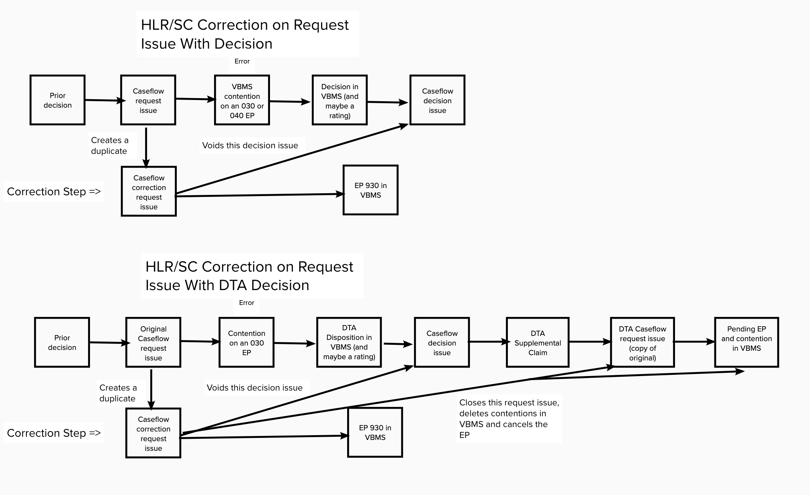

This document was moved from [appeals-team](https://github.com/department-of-veterans-affairs/appeals-team/blob/master/Project%20Folders/Caseflow%20Projects/Intake/Tech%20Specs/establish-930-corrections.md).

# Creating 930 corrections for request issues with decision issues
**Notes:**

The sections that start with a number, e.g. "1. Update the edit page", roughly contain a chunk of work.

I'm using the term "corrected" for request issues and "voided" for decision issues.

## When a request issue has one or more decision issues

### 1. Update the "Edit page"
* Show decided request issues, currently they are filtered out
* Show the current disposition(s) and decision text instead of "waiting for decision"

User selects "correct" action and saves their edit using existing flow

### 2. Void decision issues for corrected request issues
Decision issues and request issues have a many-to-many relationship.  How we approach this step depends on what to do if there are other request issues associated to the decision issues on the corrected request issue.

#### Approach 1:
* Void a decision issue for all related request issues
* Automatically correct other request issues associated to the same decision issue

#### Approach 2:
* Do not void a decision issue unless all of its related request issues are corrected
* This means the decision issue will still appear as a contestable issue
* Leave the other request issues as-is
* If all of the associated request issues are corrected, then void the decision issues

#### How to void a decision issue?
* Add voided flag on the decision_issues table
  * Works for Approach 1
  * Easiest for people to understand
  * Least flexible
* Add method on decision_issue like voided?
  * Works for Approach 1 or 2
  * Returns true if all of its request issues are corrected
  * Most flexible
  * May not be intuitive to other folks consuming our data. In order to know if a decision_issue is voided, they would need to join the request issues and see if they are corrected. I don't know if anyone else is using this data though.

### 3. Filter out voided ratings and decision issues from contestable issues
* contestable_issues_from_decision_issues
  * Filter out voided decision issues, or update decision_issue.finalized? to not include voided decision issues.
* contestable_issues_from_ratings
  * Filter out rating issues where the rating_issue_reference_id matches any of the voided decision issue rating_issue_reference_ids

### 4. Update scopes/filters elsewhere in code
* Update active_or_decided_or_withdrawn on request issues to not include request issues that are decided, but have been corrected
* Research if decision issues are being used anywhere else where we want to filter out voided decision issues

## When the decision issues are contested (automatic process for DTA dispositions)

### Questions:
* How long is a request issue eligible to be corrected?
  * Do we only want to allow this for DTA dispositions?
  * Can we prevent corrections on issues that have been contested again by the veteran?

### 5. Close contested_by request issues
* Close related request issues on the new claim with status: TBD
  * contested_decision_issue_voided ?
* Remove their contentions
* Cancel the EP if there are no remaining request issues on it
* Since this is happening on another claim, do we still want the user on the other claim to be able to see these issues (like ineligible request issues)? The default behavior is to hide them.

## When the decision issue is contested, and has been decided again
### Option 1
* Prevent corrections on these issues

### Option 2
* Option 1, plus guide people to correct the latest request issue that hasn't been contested/decided again.

### Option 3
* Allow correcting these issues
* Add an option to "remove" a decision issue (void it without creating a new correction request issue for it)
* This would have to happen for all request issues and decision issues after the corrected request issue in the chain.

## Not yet covered
1. Board grant effectuations
2. Corrections on DTA supplemental claims

## Flow diagram

